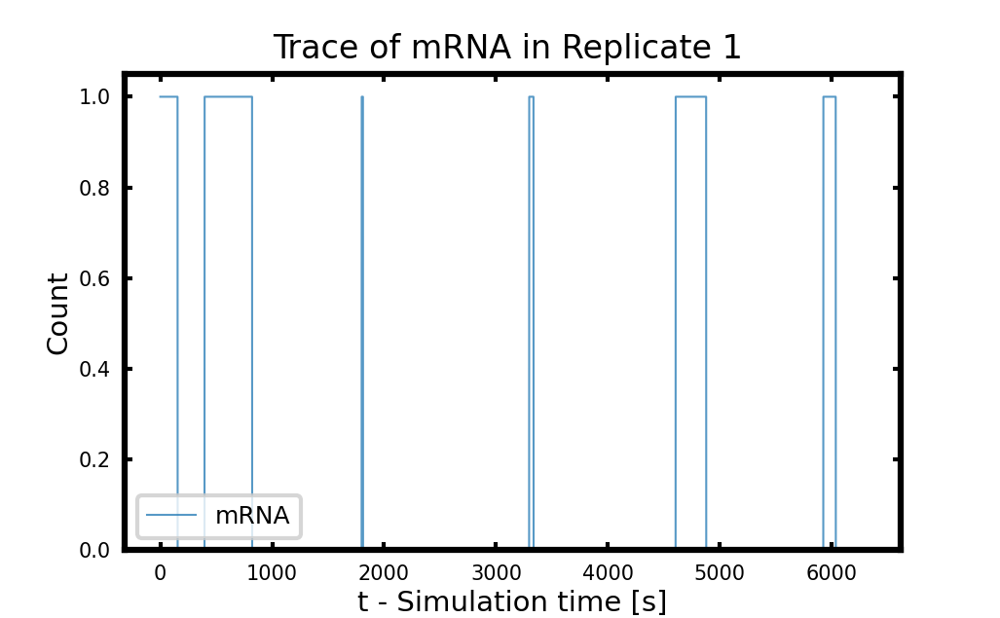
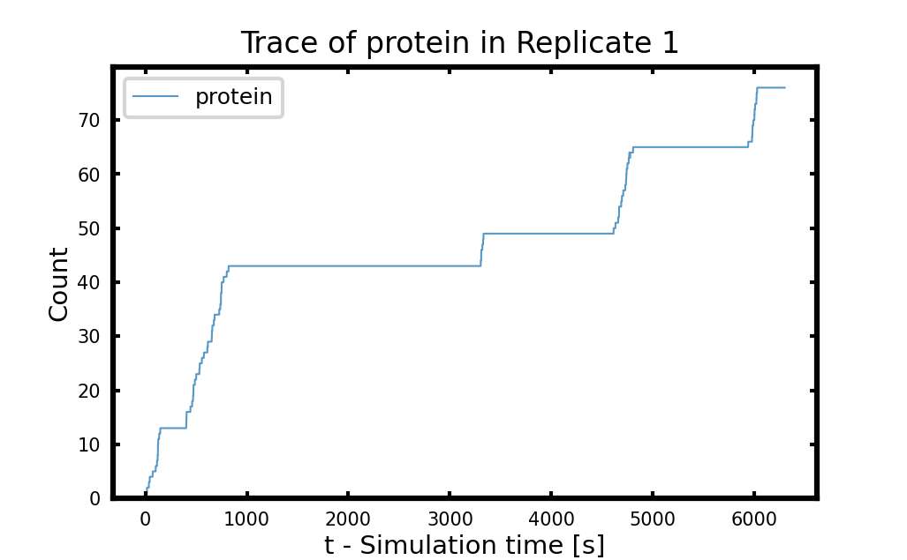
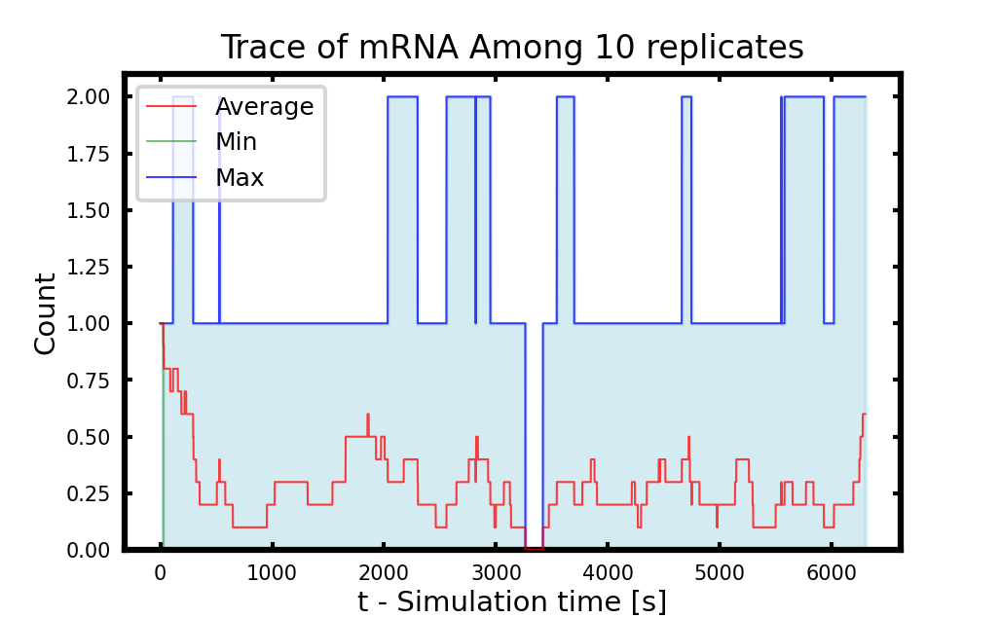
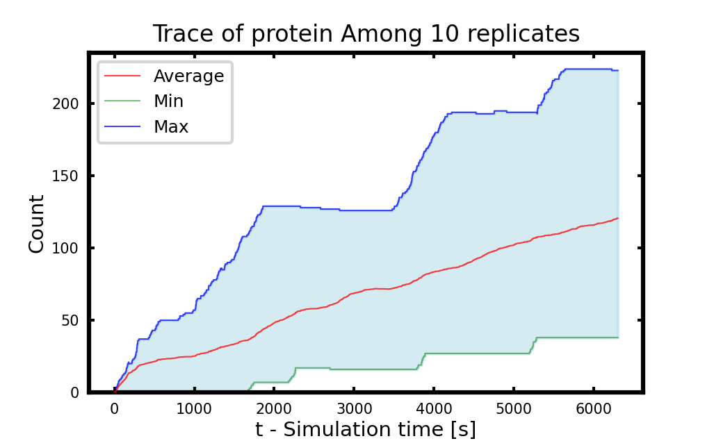
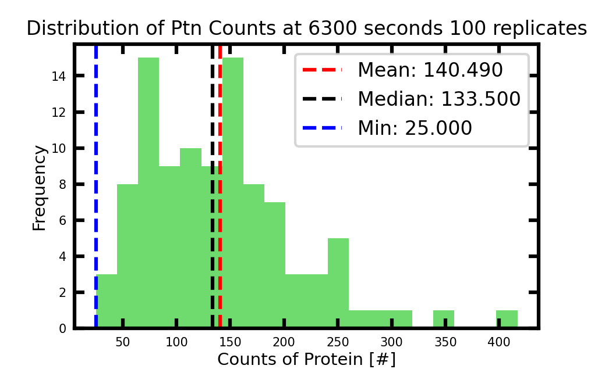

# Stochastic Genetic Information Processs in CME

Open [ChatGPT](https://chatgpt.com/) and ask this question:

**Give an example on large differences in rate constants that lead to significant fluctuations**

You can ask ChatGPT to give you more examples. Please also check this answer: [stochastic genetic information processes](https://chatgpt.com/c/91d87e61-bae5-4b89-b078-d1d4cfa44274), which is this tutorial.

## Classic Genetic Information Processes Reactions

With 3 species and 4 reactions, this classic and simplest genetic information process (GIP) starts from the transcription of gene to mRNA. mRNA can be translated to protein or degraded to its monomers. Protein can also be degraded. The reactions and rate constant is shown in Figure \ref{fig:gip2024} and Table \ref{tab:GIP}.

The rate constants are for DnaA Coding Gene (G\_0001) of minimal cell. The first three rate constants are calculate based on the initial concentrations of nucleotides and amino acids charged tRNA in the Cell paper \cite{thornburg_fundamental_2022}. We also fix the gene copy number to 1 and assume initial count of mRNA to be 1. The initial count of protein is 0. The degradation rate of protein is estimated based half-life 25 hours \cite{thornburg_kinetic_2019}.

## Run the Jupyter Notebook

Now go to file on your Jupyter Notebook webpage `Tut2.1-GeneticInformationProcess.ipynb` to simulate this toy GIP model. The default simulation length `simtime` is 6300 seconds, the entire cell cycle of minimal cell.We simulate 10 independent cell `reps` and write out the trajectories at `writeInterval` of 1 second.

## Stochastic Protein Synthesis

First, we can plot the traces of mRNA and protein in different single replicates to see the stair-stepping trace of mRNA and the burst of protein in **Figure 1**. You will an increase/burst in protein count when there are mRNAs and the protein count holds or gradually decrease when no mRNA. You are encouraged to compare the pattern shown here to your own plots. 

     
  <b>Figure 1. Left: star-stepping trace of mRNA in single cell replicate 1; Right: Burst-like protein synthesis in the same replicate</b>

We can also see the average, minimum and maximum of mRNA and protein counts over the whole simulation time span.

     
  <b>Figure 2. Population average, minumum, and maximum of mRNA (Left) and protein (Right) among 10 replicates</b>

## Discussion

### 1. Stedy-state

Do mRNA and protein reach steady-state during the 6300 seconds' simulation? How can you tell this from the plots? If the fluctuation is large, try to increase the replicates numbers `reps` from 10 to 100.

### 2. Doubling the initial abundace of protein for cell division
The initial count of protein P\_0001/DnaA from experimental proteomics data is 148. Compare the mean count of protein at the end of the cell cycle to this experimental count. Does the simulation roughly generate 148 proteins during the entire cell cycle? And why this is important? Please consider cell division.

    
  <b>Figure 3. Distribution of protein abundances among 100 cell replicates at the of the cell cycle</b>

