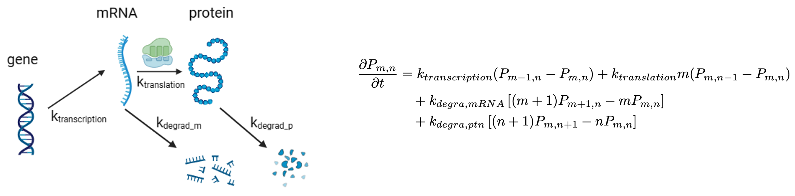
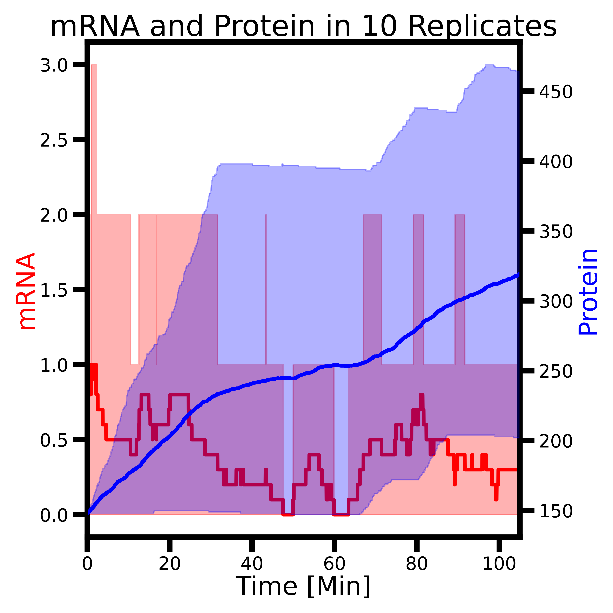
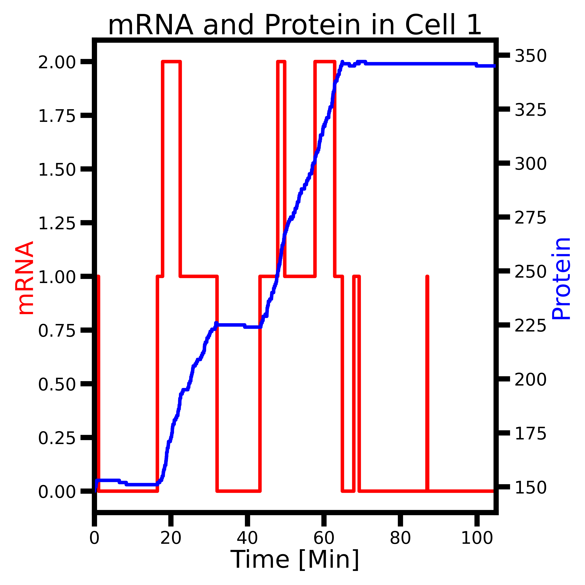
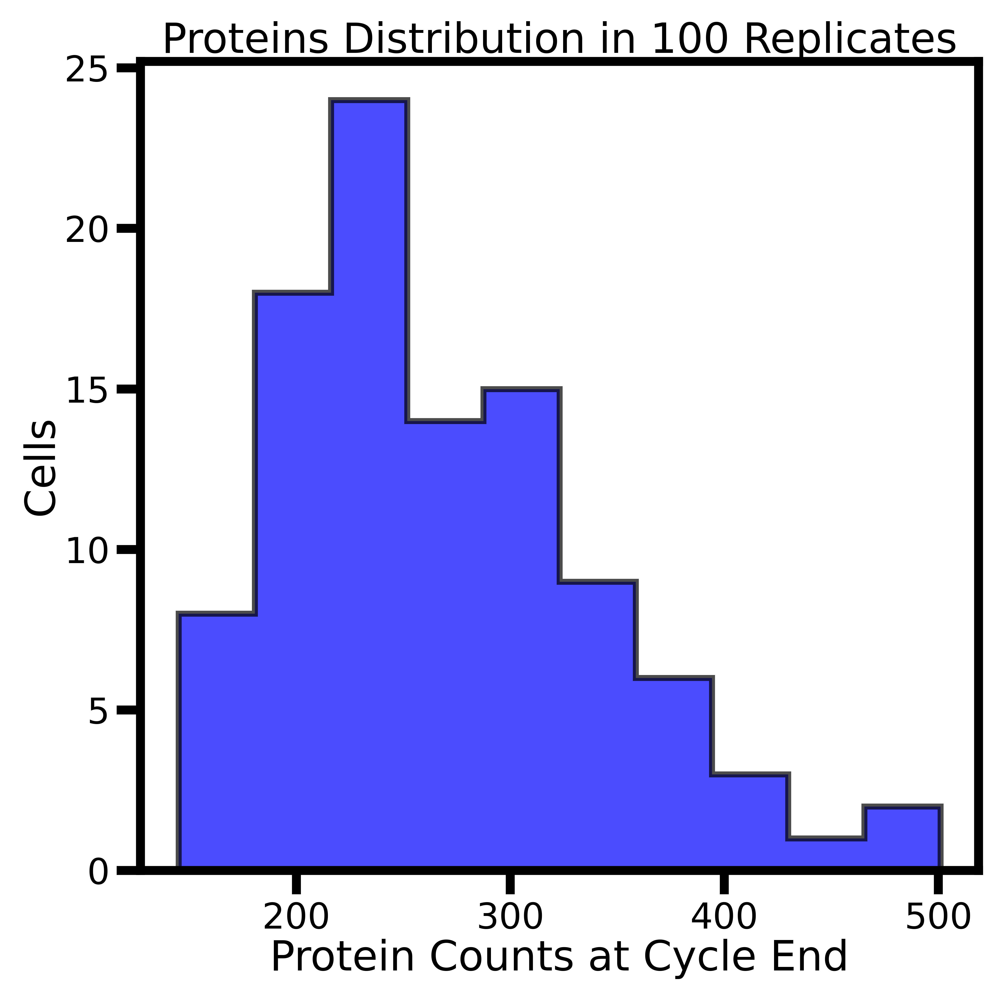

# Stochastic Genetic Information Processes in CME

Open [ChatGPT](https://chatgpt.com/) and ask the following question:

**Give an example of large differences in rate constants that lead to significant fluctuations.**

Please also review this previous response: [Stochastic Genetic Information Processes](https://chatgpt.com/c/91d87e61-bae5-4b89-b078-d1d4cfa44274), which corresponds to this tutorial.

## Classic Genetic Information Process Reactions

This classic and minimal genetic information process (GIP) model consists of 3 species and 4 reactions. It begins with the transcription of a gene into mRNA. The mRNA can be translated into protein or degraded into its monomers. The resulting protein can also undergo degradation. The reaction scheme and associated rate constants are shown below.

     
  <b>Figure 1. Genetic information processing model and its corresponding chemical master equation, where <i>m</i> and <i>n</i> are the counts of mRNAs and proteins.</b>

The rate constants are based on the protein DnaA from the minimal cell. The first three rate constants were calculated using the initial concentrations of nucleotides and aminoacyl-tRNAs reported in the *Cell* paper[^thornburg_cell]. 

We assume the gene copy number is fixed at 1 and the initial mRNA count is 1, and the initial protein count is 148 from the proteomics study. The protein degradation rate is estimated based on a half-life of 25 hours[^thornburg_kinetic].

**Table 1. Four reactions with their rate constants**

| **Names**              | **Reaction**                          | **Rate Constant (s-1)**                              | **Propensity (s-1)**                              |
|------------------------|----------------------------------------|------------------------------------------------------|---------------------------------------------------|
| Transcription          | Gene → mRNA                            | *k*transcription = 6.41×10-4   | *k*transcription                       |
| Degradation of mRNA    | mRNA → ∅                               | *k*deg,m = 2.59×10-3           | *k*deg,m · *N*mRNA          |
| Translation            | mRNA → mRNA + Protein                  | *k*translation = 7.20×10-2     | *k*translation · *N*mRNA    |
| Degradation of Protein | Protein → ∅                            | *k*deg,p = 7.70×10-6           | *k*deg,p · *N*ptn           |

## Run the Jupyter Notebook

Open the Jupyter Notebook interface and navigate to the directory `/CME/GIP/`. Run the notebook `Tut2.1-GeneticInformationProcess.ipynb` to simulate this toy model of genetic information processing (GIP). 

By default:
- The total simulation time `simtime` is set to 6300 seconds, representing the full cell cycle of the minimal cell.
- We simulate 10 independent cells (`reps = 10`).
- Trajectories are recorded at intervals of 1 second (`writeInterval = 1`).

## Stochastic Protein Synthesis

We begin by examining the average and variation in mRNA and protein abundances across the population of 10 simulated cells. The population-averaged mRNA abundance fluctuates below 1 throughout the cell cycle, while protein levels increase steadily due to translation. Protein degradation is minor under this set of kinetic parameters.

Protein synthesis is a stochastic process that occurs in individual cells. By plotting the time traces of mRNA and protein for several replicates, you can observe the characteristic stair-step pattern of mRNA production and burst-like synthesis of proteins. You will see that protein levels increase or "burst" when mRNAs are present, and may plateau or decrease when mRNAs are absent. We encourage you to compare the patterns shown here with your own simulation results.

   
    
  <b>Figure 2. Left: Population average (solid line) and full range (shaded area) of mRNA (red) and protein (blue) abundances across 10 cell replicates.   
  Right: Stair-step mRNA trace and burst-like protein synthesis in a single cell replicate.</b>

## Discussion

### 1. Steady-State

Do mRNA and protein levels reach a steady state during the 6300-second simulation? How can you tell from the plots? If the fluctuations are large, try increasing the number of replicates `reps` from 10 to 100.

### 2. Doubling the Initial Abundance of Protein for Cell Division

The initial count of protein P\_0001 (DnaA) from experimental proteomics data is 148. In the histogram below, the average DnaA count at the end of the cell cycle is approximately 270. Compare the mean protein count at the end of the simulation to this experimental value. Does the simulation produce roughly 148 new proteins over the full cell cycle? Why is this important? Consider the implications of cell division into two daughter cells.

    
  <b>Figure 3. Distribution of protein abundances among 100 cell replicates at the end of the cell cycle.</b>

## References:
[^thornburg_cell]: Thornburg, Z. R., Bianchi, D. M., Brier, T. A., Gilbert, B. R., Earnest, T. M., Melo, M. C., Safronova, N., Sáenz, J. P., Cook, A. T., Wise, K. S., Hutchison, C. A., Smith, H. O., Glass, J. I., & Luthey-Schulten, Z. (2022). Fundamental behaviors emerge from simulations of a living minimal cell. Cell, 185(2), 345-360.e28. https://doi.org/10.1016/j.cell.2021.12.025

[^thornburg_kinetic]: Thornburg, Z. R., Melo, M. C. R., Bianchi, D., Brier, T. A., Crotty, C., Breuer, M., Smith, H. O., Hutchison, C. A., Glass, J. I., & Luthey-Schulten, Z. (2019). Kinetic modeling of the genetic information processes in a minimal cell. Frontiers in Molecular Biosciences, 6. https://doi.org/10.3389/fmolb.2019.00130
