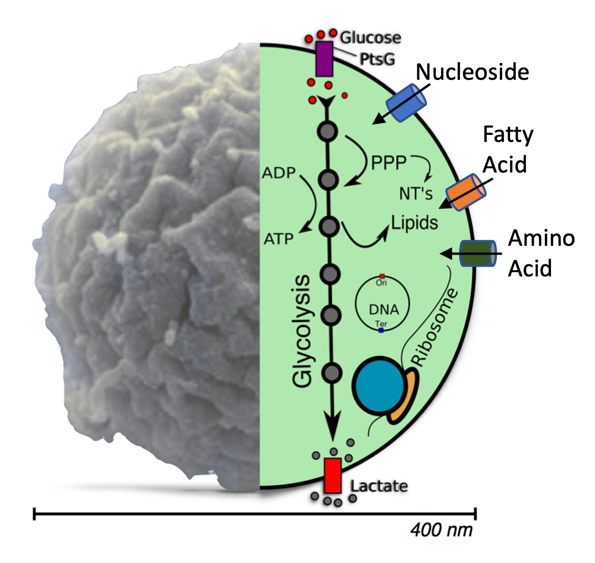

# Coupled Genetic Information Processes and Metabolism in Minimal Cell, JCVI-syn3A

## Description:



In ***Coupled genetic information processes and metabolism in Minimal Cell*** tutorial, you will first learn the basic of stochastic kinetic simulation of a [bimolecule reaction](bimolecule/), then a model [genetic information process](GIP/) solved by chemical master equations (**CMEs**). The essential metabolism[^breuer_metabolism] in Syn3A imports nutrients in the growth media, and further converts them to generate ATP molecules that energize cellular processes, and monomers for the synthesis of proteins, RNAs, and chromosome. To simulate the [co-evolution of GIP and metabolism in Syn3A](WCM/), we employ a hybrid stochastic-deterministic algorithm[^bianchi_CMEODE] where stepwise communication is performed to describe the interactions between these two subsystems.

*This tutorial was prepared for NSF Science and Technology Center for Quantitative Cell Biology Summer School organized in July.*

## Outline:

1. Set up the tutorial on Delta
2. Introduction to Lattice-Microbe, a GPU Accelerated Stochastic Simulation Platform
3. Tutorial: Bimolecular Reaction Solved Stochastically in CME
4. Tutorial: Stochastic Genetic Information Processs in CME
5. Tutorial: CME-ODE Whole-Cell Model of a Genetically Minimal Cell, JCVI-Syn3A
   
## 1. Set up the tutorial on Delta

You will SSH into [NCSA Delta](https://docs.ncsa.illinois.edu/systems/delta/en/latest/quick_start.html) to conduct the computational tasks.

### Login into Delta 

```bash
ssh USERNAME@login.delta.ncsa.illinois.edu
```
> [!WARNING]
> ***Replace*** `USERNAME` with your Delta username. 

To successfully login, you need to type your password for NCSA and do 2FA.

###  Copy tutorials into your own directory

Navigate to your directory

```bash
cd /projects/beyi/$USER
```

Copy the prepared materials to your directory. This step may take several minutes since the large Apptainer file and prepared CME-ODE WCM trajactories.

```bash
cp -r /projects/beyi/enguang/CME ./
```

### Launch Jupyter Notebook on Delta
>[!NOTE]
>You will use Jupyter Notebook to run Tutorials bimolecule, GIP and the analysis part of Tutorial WCM. 

The advantage of Jupyter Notebook is that you could navigate the folders and run the `.ipynb` files using GUI.

- **First**: Submit a job to a Delta GPU node.  
    Here `srun` launch interactive job onto Delta, `partition` claims A100 GPU node, and for 6 hours `time`. A four digit number is randomly generated to specify the `port` for Jupyter Notebook. 

  ```bash
  srun --account=beyi-delta-gpu --partition=gpuA100x4 --time=04:00:00 --mem=64g --gpus-per-node=1 --tasks-per-node=1 --cpus-per-task=16 --nodes=1 apptainer exec --nv --containall --bind /projects/beyi/$USER/:/workspace /projects/beyi/$USER/CME/summer2025.sif bash -c "source /root/miniconda3/etc/profile.d/conda.sh && conda activate lm_2.5_dev && jupyter notebook /workspace/ --no-browser --port=$((RANDOM%9000+1000)) --ip=0.0.0.0 --allow-root"
  ```  

  Then you should wait for Delta to allocate the resources for you that usually takes less than 1 minute. When you see similar things as the following, you are good to proceed to the second step:
  ```bash
  srun: job 3546627 queued and waiting for resources
  srun: job 3546627 has been allocated resources
  WARNING: could not mount /etc/localtime: not a directory
  [I 19:07:57.203 NotebookApp] Writing notebook server cookie secret to /u/$USER/.local/share/jupyter/runtime/notebook_cookie_secret
  [I 19:07:58.314 NotebookApp] [jupyter_nbextensions_configurator] enabled 0.6.3
  [I 19:07:58.316 NotebookApp] Serving notebooks from local directory: /workspace
  [I 19:07:58.316 NotebookApp] Jupyter Notebook 6.4.12 is running at:
  [I 19:07:58.316 NotebookApp] http://`DeltaNode`.ncsa.illinois.edu:8811/?token=b2e7ca15cd9dc3a6893a1273e359c88869225bc29d66c80c
  [I 19:07:58.316 NotebookApp]  or http://127.0.0.1:$Port/?token=b2e7ca15cd9dc3a6893a1273e359c88869225bc29d66c80c
  [I 19:07:58.316 NotebookApp] Use Control-C to stop this server and shut down all kernels (twice to skip confirmation).
  [C 19:07:58.329 NotebookApp]

      To access the notebook, open this file in a browser:
          file:///u/$USERNAME/.local/share/jupyter/runtime/nbserver-13-open.html
      Or copy and paste one of these URLs:
          http://$DeltaNode.delta.ncsa.illinois.edu:$Port/?token=b2e7ca15cd9dc3a6893a1273e359c88869225bc29d66c80c
      or http://127.0.0.1:$Port/?token=b2e7ca15cd9dc3a6893a1273e359c88869225bc29d66c80c
  ```

  The last two line contains the Delta GPU node `DeltaNode`, which is the node assgined by Delta to run your job. The `Port` is four digits randomly generated.

- **Second**: SSH into the Delta GPU node.  
  Open a **second** terminal and run the following command.
  ```bash
  ssh -l $USERNAME  -L 127.0.0.1:$Port:$DeltaNode.delta.internal.ncsa.edu:$Port dt-login.delta.ncsa.illinois.edu
  ```
  You need to type you password and do 2FA AGAIN.

>[!WARNING]
>***Replace*** `DeltaNode` with the node assgined by Delta.    
>***Replace*** `USERNAME` with your Delta username.   
>***Replace*** `Port` with the 4 digit number generated.  

- **Third**: Open Jupyter Notebook Webpage.   
  Copy the last URL in the first terminal and paste to one browser (Firefox, Chrome, ...) to open Jupyter Notebook.

## 2. Introduction to Lattice Microbe

**Go to [Introduction](introduction/)**

## 3. Tutorial: Bimolecular Reaction Solved in ODE and CME

**Go to [bimolecule](bimolecule/)**

## 4. Tutorial: Genetic Information Processs in CME

**Go to [Genetic Information Processes](GIP/)**

## 5. Tutorial: CME-ODE Whole-Cell Model of a Genetically Minimal Cell, JCVI-Syn3A

**Go to [CME-ODE WCM of Syn3A](WCM/)**

## References:
[^breuer_metabolism]: Essential metabolism https://doi.org/10.3389/fmicb.2021.685687
[^bianchi_CMEODE]: Communication 10.1049/iet-syb.2017.0070
