# CME-ODE Whole-Cell Model of a Genetically Minimal Cell, JCVI-Syn3A

## Outline:
1. [Run CME/ODE Whole-Cell Model in Parallel](#1-run-cmeode-whole-cell-model-in-parallel)
2. [Minimal Genome and Genetic Information Processes](#2-minimal-genome-and-genetic-information-processes)
3. [Essential Metabolism](#3-essential-metabolism)
4. [Macromolecular Complex Assembly]()
5. [Hybrid CME-ODE Algorithm](#4-hybrid-cme-ode-algorithm)
6. [Analysis](#5-analysis)
7. [Discussion](#6-discussion)
  
## 1. Run CME/ODE Whole-Cell Model in Parallel

We launch independent cell replicates to sample the statistically significant cellular dynamics. To increase the simulation speed, running independent replicates in parallel is inevitable. In our current implementation, we use `mpirun` module to launch simulation python scripts in parallel.  

For each indepedent cell replicate, the main script `WCM CMEODE Hook.py` will call multiple python scripts to construct and simulate the genetic information processes, metabolism and their interactions over the whole cell cycle. The CME simulation is executed using Lattice Microbes (LM) with direct Gillespie algorithm. We employ the `hookSimulation` function to interrupt the CME timeline and enable communication with the ODE solver. For the ODE simulation, we use the **[odecell](https://github.com/Luthey-Schulten-Lab/odecell)** software developed by the Luthey-Schulten Lab, which maps metabolic reactions to ordinary differential equations and specifies the corresponding kinetic parameters. The resulting ODE system is solved using the *lsoda* algorithm from the SciPy library.

### Scripts

<details>
<summary><strong>Click to EXPAND: Explanation of All Scripts </strong></summary>

#### Launch Simulation in Parallel

- `mpirun.sh` — Bash file to claim the time length, # of replicates, and communication interval

#### Main Driver

- `WCM_CMEODE_Hook.py` — Main script to launch the CMEODE simulation.

#### Simulation Core

- `species_counts.py` — Python Class for managing species count data in the hook algorithm.
- `integrate.py` — Performs ODE integration using *lsoda* from Scipy.
- `initiation.py` — Initializes constants, time traces, and cell membrane.
- `communicate.py` — Syncs CME and ODE states, computes costs, and updates the membrane.
- `hookSolver_CMEODE.py` — Defines `hookSimulation`, the main hook interval operation.
- `hook_CMEODE.py` — Manages operations that communicate CME and ODE during hooks.
- `filesaving.py` — Exports time traces, surface area, and fluxes to CSV files.

#### Biology Modules

- `rxns_CME.py` — Adds genetic information process (GIP) reactions to CME (e.g., replication, transcription, translation, tRNA charging).
- `cme_complexation.py` — Adds protein complex formation reactions to CME.
- `rxns_ODE.py` — Builds the ODE system using `odecell` (metabolic parameters from `kinetic_params.xlsx`).
- `replication.py` — Defines DNA replication initiation and reactions (GIP parameter from `kinetic_params.xlsx`).
- `GIP_rates.py` — Computes reaction rates for GIP processes (GIP parameter from `kinetic_params.xlsx`).

</details>

<!-- <p align="center">
  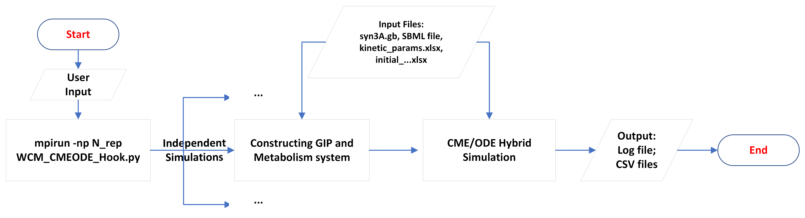 <br>
  <b>Figure 1. Launching Independent Whole Cell Simulations in Parallel using mpirun module. The user input will be passed to claim the replicates number, time length, and hook interval.</b> <br>
  <b>Each simulation is independent with each other. In current simulation we have four main input files and the trajectories will be stored in CSV files with an additional log file.</b>
</p> -->


<p align="center">
  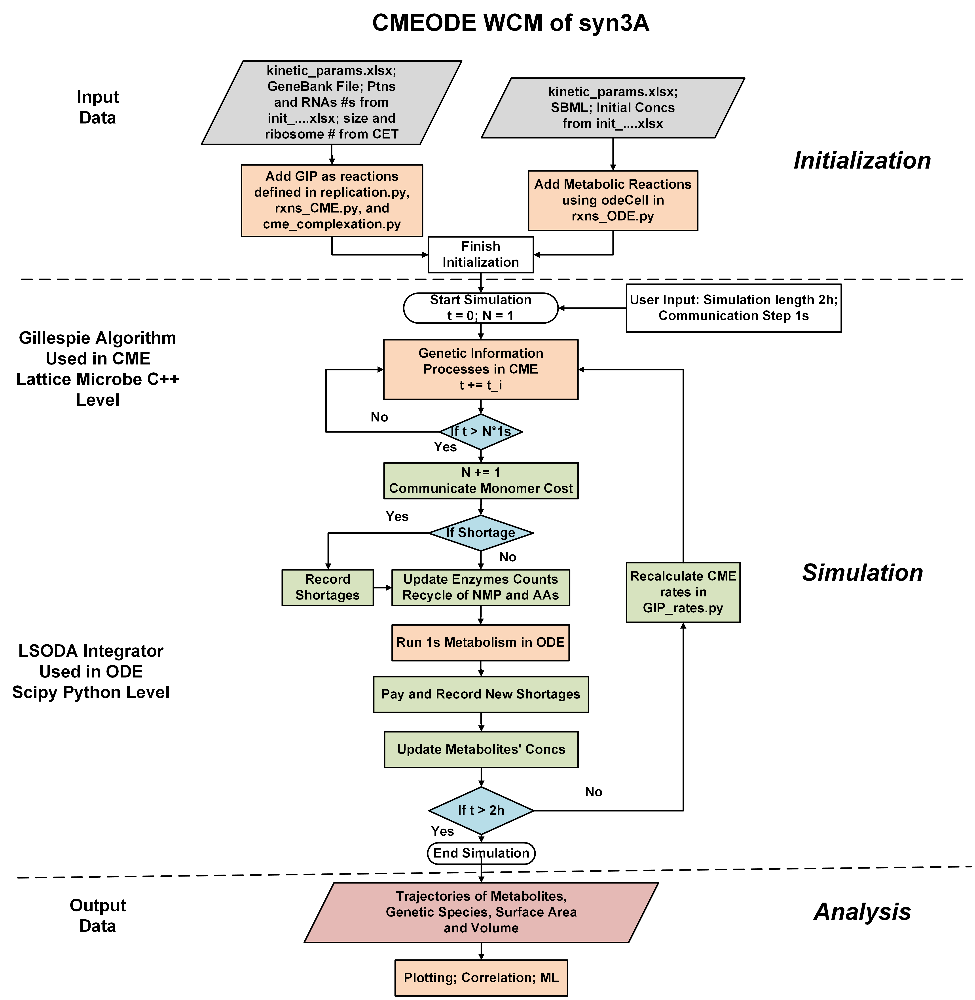 <br>
  <b> Figure 1. Flowchart of one simulation instance of CME-ODE WCM of Syn3A</b>
</p>


The spatially homogeneous simulations can be efficiently parallelized across up to 25 indepedent cell replicates or more, with each replicate requiring less than 2GB of RAM. On systems equipped with AMD EPYC 7763 “Milan” processors on **[Delta](https://docs.ncsa.illinois.edu/systems/delta/en/latest/index.html)** or Intel Xeon Gold 6154 CPUs @ 3.00 GHz on normal workstation, the parallel simulations of 2 biological hours with communication step of 1 s typically complete within **6 physical hours**.

Due to the time limitation, you will launch 2 minutes simulation of 4 cell replicates. You are encouraged to change the parameters to run longer of more replicates.

### Launch Four Cell Replicates

<details>
<summary><strong>Click to EXPAND: Launch Simulation in Parallel </strong></summary>

+ **First**: Open **another** new terminal and login to Delta again

+ **Second**: Navigate and Submit the bash file

    ``` bash
    cd /projects/beyi/$USER/CME/WCM/programs
    ```

    ```bash
    sbatch mpirun.sh
    ```
  
+ **Third**: Check the status of your job.  
    ```bash
    squeue -u $USER
    ```
    *PD* means waiting to run, *R* running.

    Go to output folder `output_4replicates` 
    
    ``` bash
    cd /projects/beyi/$USER/CME/WCM/output_4replicates
    ```
</details>

Each simulation replicate with index *i* generates:

- `counts_i.csv`: Species count trajectories of metabolites from ODE and genetic particles from CME (units: molecules).
- `SA_i.csv`: Surface area (nm$`^2`$ or m$`^2`$) and volume (L) trajectories.
- `Flux_i.csv`: Fluxes through ODE reactions (units: mM/s).
- `log_i.txt`: Log file with timestamps, printed reactions, run times, and any warnings/errors.

Output files are saved to directories defined and created in `mpirun.sh`. Typical CSV file size ranges from **100–200 MB** for a 7200 s simulation with 1 s hook intervals.


### Input Files

Four main input files are used in whole-cell simulation: one Genbank file, one SBML file, and two Excel files. The `syn3A.gb` Genebank file contains the sequences and functions of genes, RNAs, and proteins, and the `Syn3A_updated.xml` SBML file contains the metabolic reactions (reactants, stoichiometries). The `intitial_concentration.xlsx` file contains the initial count/concentrations of proteins and metabolite while `kinetic params.xlsx` contains the kinetic parameters of the GIP and metabolic reactions.


<details>
<summary><strong>Click to EXPAND: Breakdown of Input Files</strong></summary>

- `syn3A.gb` — GenBank file of JCVI-Syn3A 
  - Obtained from ([NCBI Accession: CP016816](https://www.ncbi.nlm.nih.gov/nuccore/CP016816)).
  - Encodes genome sequence, segmentation, and gene annotations.

- `Syn3A_updated.xml` — Includes metabolites, compartments, reactions, and gene associations.
  - Updated SBML model from [*eLife*, 2019](https://elifesciences.org/articles/36842).
  - Standard file format in system biology.
  - Read in for Reaction and stoichiometries by `rxns_ODE.py`.

- `initial_concentration.xlsx` — Provides initial conditions for proteins, medium, and metabolites.
  -  Update from [*Cell*, 2022](https://www.sciencedirect.com/science/article/pii/S0092867421014884?via%3Dihub#da0010).
  - **Sheet breakdown**:
  - **Comparative Proteomics**: Protein initial counts for CME.
  - **Simulation Medium**: Medium composition for simulation.
  - **Intracellular Metabolites**: Metabolite concentrations in cytoplasm for ODE.
  - **mRNA count**: Initial average count of mRNAs for CME.
  - **Protein Metabolites**: Protein metabolite IDs used in `initiation.py` and `rxns_ODE.py`.

- `kinetic_params.xlsx` — Contains kinetic parameters for ODE reactions, tRNA charging, and gene expression
  - Update from [*Cell*, 2022](https://www.sciencedirect.com/science/article/pii/S0092867421014884?via%3Dihub#da0010).
  - **Sheet Breakdown:**
  - **Central, Nucleotide, Lipid, Cofactor, Transport**: Random binding + convenience rate law reactions (`rxns_ODE.py`).
  - **Non-Random-binding Reactions**: Passive transport and serial phosphorelay reactions (`rxns_ODE.py`).
  - **tRNA Charging**: Aminoacylation parameters (`rxns_CME.py`).
  - **Gene Expression**: Parameters in gene expression (`rxns_CME.py`, `replication.py`, and `GIP_rates.py`)
  - **SSU Assembly, LSU Assembly**: Reactions and rates of SSU and LSU assembly

- `complex_formation.xlsx` — Defines the composition and initial counts of protein complexes.

</details>

Now, we will focus on gene **JCVISYN3A_0011** to show how the different input files function in our simulation.

The genome information of JCVI-syn3A is stored as standard Genbank file on NCBI with [ACCESSION Number CP016816.2](https://www.ncbi.nlm.nih.gov/nuccore/CP016816.2/). The Genbank file holds much more information than the pure nucleotide sequence. 

Go to Genbank file under `input_data` folder and open with text editor. Search **JVCISYN3A_0011** and you wil see the following figure. **JCVISYN3A_0011** is the LocusTag of this certain gene in organism JCVI-syn3A, and *JCVISYN3A_* serving as a unique idetifier. 0011 is the locusNum that will be heavily used in the modelling to distinguish unique genes, RNAs, and proteins from each other. The start and end index of **JCVISYN3A_0011** is 15153 and 16799, respectively and the nucleotide sequence is at the end of the Genbank file. **JCVISYN3A_0011** is protein-coding gene and the protein is "Nucleoside Transporter ABC substrate-binding protein" with amino acid sequence shown. This protein is one subunit of ribonucleoside ATP-binding cassette (ABC) transporters that is assumed to import all nucleosides for Syn3A.

<p align="center">
  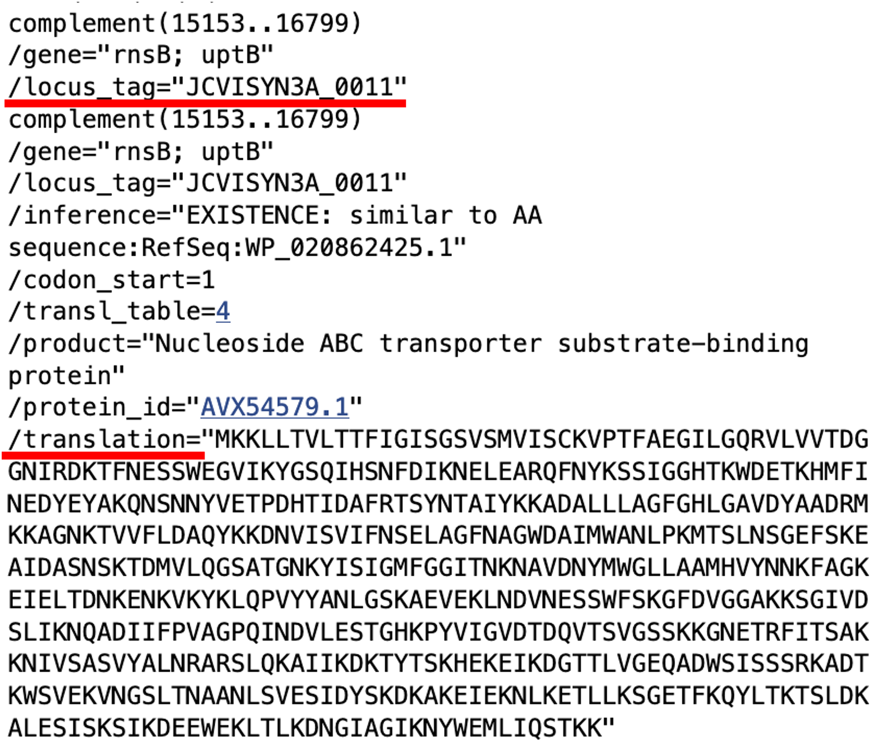 <br>
  <b>Figure 2. Entry JCVISYN3A_0011 in Syn3A's Genbank file</b>
</p>

SBML (System Biology Markup Language) format is widely used in storing computational models of biological processes. The SBML file here contains the whole metabolic system of Syn3A, including compartments (cellular and extracellular), species, reactions, gene product (enzymatic or transporter proteins associated with reactions), and objective function (for Flux Balance Analysis). 
It's worth noting that the kinetic constants of 175 reactions are in \textit{kinetic\_params.xlsx}.

Nucleoside Transporter ABC substrate-binding protein encode by gene **JCVISYN3A_0011** functions in reaction DSGNabc, irreversible transport of deoxyguanosine in nucleotide metabolism. Figure \ref{fig:sbml} shows reaction DSGNabc in SBML file. We define \textit{reversible} as \textit{false} since DSGNabc is a irreversible transport reaction. There are three reactants and four products. The geneProductAssociation rule is *and*, meaning the four subunit proteins (**0008, 0009, 0010, and 0011**) need to assembly to function cooperatively. In the latest WCM with incorporated macromolecular complex formation, we considered the assembly of 21 unique complexes, including this ABC transporter named **rnsBACD**. By doing so, we can use the actual abundance of this complete complex in the simulation of metabolism by ODE. 

<p align="center">
  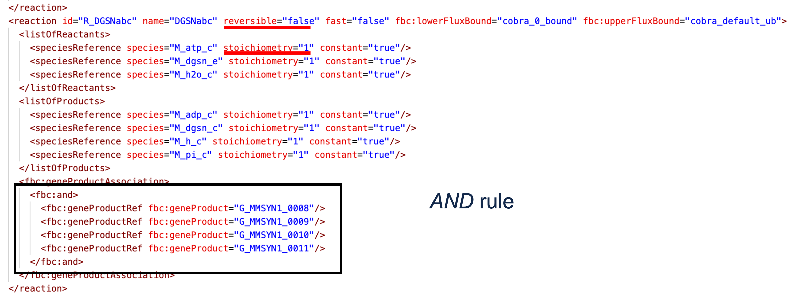 <br>
  <b>Figure 3. Entry Reaction DSGNabc in SBML file</b>
</p>

The kinetic constants for this DSGNabc reaction in `kinetic\_params.xlsx` is shown as following.

<p align="center">
  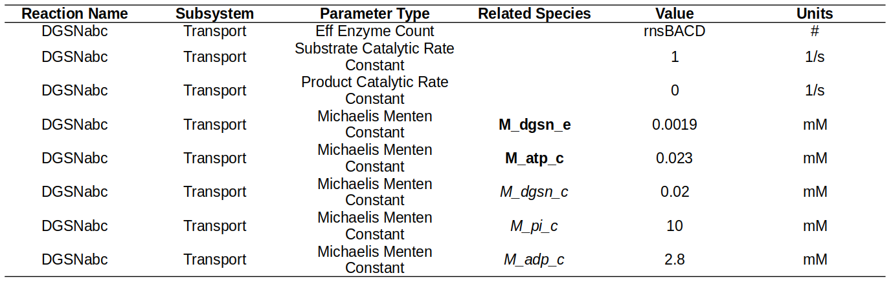 <br>
  <b>Figure 4. Kinetic Constants for Reaction DSGNabc</b>
</p>

## 2. Minimal Genome and Genetic Information Processes

### Genetically Minimized Bacterium, JCVI-Syn3A

Minimal cell, JCVI-syn3A is a synthetic bacterium based on mother organism Mycoplasma mycoides capri published by J. Craig Venter Institute in 2016 \cite{hutchison_design_2016}. JCVI-syn3A has a doubling time of about 2 hours and consistently forms spherical cells of approximately 200 nm in radius.

JCVI-syn3A's genome is minimal in all living organism, 543 kbp long and containing 452 genes code for proteins and 38 genes for RNAs. The ratio of unclear protein-coding genes is 90 out of 452, which is also smallest compared to other well-studied organism, including yeast and E. coli \cite{breuer_essential_2019}.

<p align="center">
   <br>
  <b>Figure 5. Left: Protein Coding Genes of JCVI-syn3A. Only less than 90 genes are unclear.  <br>
  Right: JCVI-syn3A with genetic information processes and metabolism shown. </b>
</p>

### Genetic Information Processes

Genetic information processes connect the blueprint genes to functional proteins. In our current whole cell model of minimal cell, we mainly consider seven types of processes listed in table.

Replication copies the genetic information with the regulation of replication initiation. Transcription copies sequential information from DNA to RNA. There are three types of RNA, including mRNA, rRNA and tRNA that are tightly connected by translation. Translation takes place on ribosomes, where mRNA is read and an amino acid chain is generated according to the sequence of mRNA. rRNA, together with other ribosome proteins make up ribosomes in ribosomal biogenesis \cite{earnest_ribosome_2016}. tRNA is the carriers and identifier of amino acid to the ribosome. 

<p align="center">
  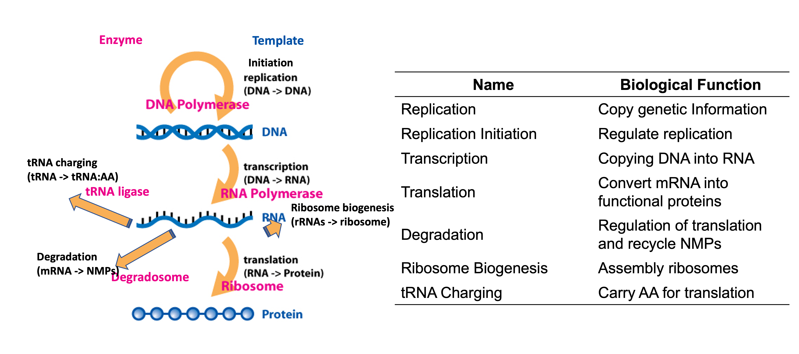 <br>
  <b>Figure 6. Left: Genetic Information Flow. <br>
  Right: Functions of GIP reactions. </b> 
</p>


The translation and degradation reactions in current whole cell model are more precise compared to the simplest case in Tutorial 2 as for each reaction, mRNA first needs to bind with a complex machinery, degradosome or ribosome. As the busiest species in genetic information processes, mRNA can also be degraded by binding with degradosome. This competition of mRNA to bind with ribosome or degradosome is a important pathway to regulate genetic information processes that will shown in the following result.


Replication initiation is modeled by the binding of multi-domain protein DnaA (encoded by JCVISYN3A\_0001) and replisome with certain region called oriC on the chromosome \cite{thornburg_kinetic_2019}. 

<p align="center">
  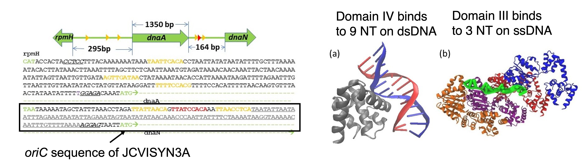 <br>
  <b>Figure 7. Left: Left: oriC region. 9 nucleotide signature binding with DnaA domain IV shown in yellow and red, 3 nuclotide AT rich region binding with DnaA domain III shown in grey. <br>
  Right: PDB structure of DnaA domain IV and domain III binding with chromosome a): \cite{fujikawa_structural_2003} b): \cite{duderstadt_dna_2011} </b> 
</p>

First stage of initiation is the binding of DnaA's Domain IV with nine-nucleotide signatures on double-strand DNA(three of them, shown in red and yellow in Figure \ref{oric_dnaA}). This binding will open a pocket for DnaA's Domain III to bind with AT rich region on single-strand DNA following the nine-nucleotide signatures to build a filament of DnaA on single-strand DNA. The final step is the binding of replisome with the chromosome after the filament grows above 15 DnaA with 30 DnaA maximum due to the length of AT rich region is 90. In current model, the assembly of replisome is not explicitly included.

<p align="center">
  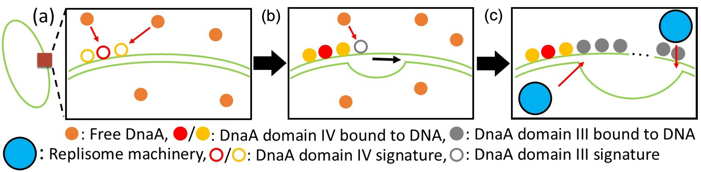 <br>
  <b>Figure 8. Three stage DNA replication initiation </b> 
</p>

Replication occurs gene by gene when replisomes move along the circular chromosome from oriC to ter in two directions. Since the locations of genes are fixed, the replication happens in order. So our replication model is ordered and bidirectional.

<p align="center">
  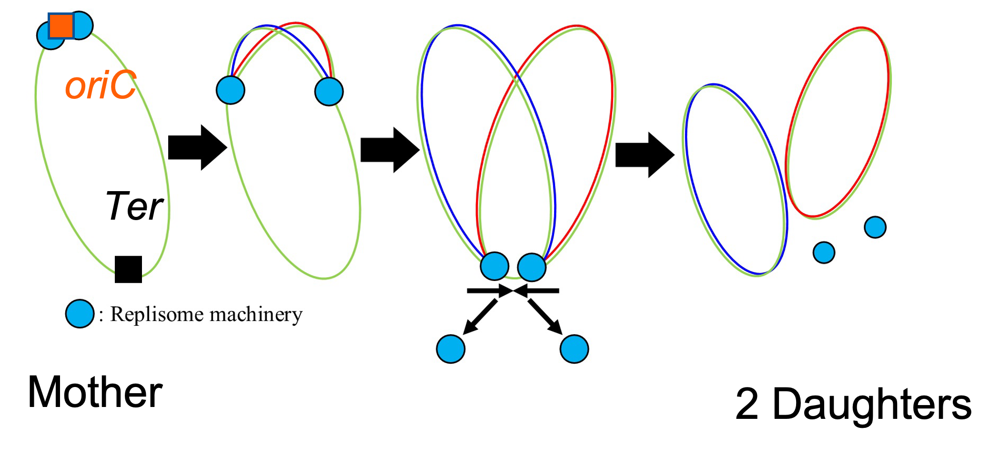 <br>
  <b>Figure 9. Ordered and Bidirectional Replication </b> 
</p>

The equivalent reaction to duplicate certain gene is in Table \ref{tab:CMErxns} The rate to replicate one gene in Table \ref{tab:CMErates} is determined by a polymerization rate form proposed in \cite{hofmeyr_generic_2013}.  

**Table 1: Reactions and Rates for Replication, Transcription, Translation and Degradation**

| **Processes**  | **Reactions**                                                                 | **Kinetic Constant**                      |
|----------------|-------------------------------------------------------------------------------|-------------------------------------------|
| Replication     | $G_{\text{locusNum}} \rightarrow 2G_{\text{elongation}}$                      | $k_{\text{replication}}^{\text{locusNum}}$ |
| Transcription   | $RNAP + G_{\text{locusNum}} \rightarrow RNAP:G_{\text{locusNum}}$            | $k_{\text{trsc}}^{\text{binding}}$         |
|                | $RNAP:G_{\text{locusNum}} \rightarrow R_{\text{locusNum}} + RNAP + G_{\text{locusNum}}$ | $s_{\text{trsc}}^{\text{locusNum}} k_{\text{trsc}}^{\text{elongation}}$ |
| Translation     | $Ribosome + R_{\text{locusNum}} \rightarrow Ribosome:R_{\text{locusNum}}$     | $k_{\text{trans}}^{\text{binding}}$        |
|                | $Ribosome:R_{\text{locusNum}} \rightarrow P_{\text{locusNum}} + Ribosome + R_{\text{locusNum}}$ | $k_{\text{trans}}^{\text{elongation}}$ |
| Degradation     | $Degradosome + R_{\text{locusNum}} \rightarrow Degradosome:R_{\text{locusNum}}$ | $k_{\text{degra}}^{\text{binding}}$       |
|                | $Degradosome:R_{\text{locusNum}} \rightarrow NMPs + Degradosome$              | $k_{\text{degra}}^{\text{depoly}}$        |

Transcription, translation and degradation are all depicted as a two-step binding and (de)polymerizatoin reactions where the polymerization in transcription and translation shares the same rate form as that in replication. The rate for degradation from a mRNA to its monomers is calculate by divide the monomer depletion rate over the length of mRNA.

**Table 2: Rate Form for Replication, Transcription, Translation and Degradation**

| **Processes**   | **(De)polymerization Constants**                  | **Formulation**                                                                                                                                  |
|-----------------|---------------------------------------------------|--------------------------------------------------------------------------------------------------------------------------------------------------|
| Replication     | $k_{\text{elongation}}^{\text{replication}}$      | $\dfrac{k_{\text{replication}}^{\text{cat}}}{\dfrac{K_{D1} K_{D2}}{[dNTP_1][dNTP_2]} + \sum_i \dfrac{K_{Di}}{[dNTP_i]} + L_{\text{DNA}} - 1}$     |
| Transcription   | $k_{\text{elongation}}^{\text{trsc}}$             | $\dfrac{k_{\text{transcription}}^{\text{cat}}}{\dfrac{K_{D1} K_{D2}}{[NTP_1][NTP_2]} + \sum_i \dfrac{K_{Di}}{[NTP_i]} + L_{\text{RNA}} - 1}$     |
| Translation     | $k_{\text{elongation}}^{\text{trans}}$            | $\dfrac{k_{\text{translation}}^{\text{cat}}}{\dfrac{K_{D1} K_{D2}}{[tRNA:aa_1][tRNA:aa_2]} + \sum_i \dfrac{K_{Di}}{[\text{tRNA:aa}_i]} + L_{\text{protein}} - 1}$ |
| Degradation     | $k_{\text{depoly}}^{\text{degra}}$                | $\dfrac{k_{\text{cat}}^{\text{degra}}}{L_{\text{mRNA}}}$                                                                                        |

## 3. Essential Metabolism and Rate Law

### Essential Metabolism

As mentioned, replication, transcription, and translation all require monomers (deoxyribonucleotide (dNTPs), ribonucleotide (NTPs), and amino acids (AAs)) for the polymerizations reactions. 

All the supply of monomers comes from metabolism of JCVI-syn3A. The (d)NTPs are generated in nucleotide metabolism that transport extracellular nucleoside and convert nucleoside to (d)NTPs used in the DNA and RNA synthesis. The other building blocks, such as phosphoribosyl pyrophosphate (prpp), phosphoenolpyruvate (pep), and 1,3-Bisphosphoglyceric acid (1,3dpg) along these pathways are the products in glycolysis in central metabolism \ref{NTP_supply}.

<p align="center">
  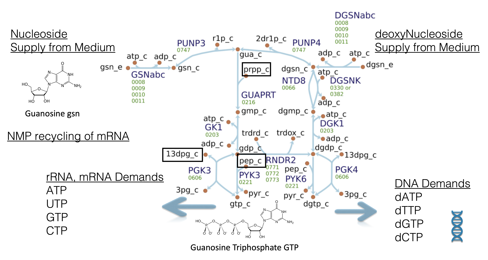 <br>
  <b>Figure 10. Supply of GTP and dGTP for DNA and RNA synthesis in nucleotide metabolism. The metabolites in the bracket come from central metabolism </b> 
</p>

The whole metabolism network can be separated to five connected sub-networks, including central, nucleotide, lipid, cofactor and amino acid. Glucose 6-phosphate (g6p) the immediate downstream of glucose in glycolysis connects central and lipid metabolism, while Adenosine triphosphate (ATP) that generated in glycolysis provides energy for reactions in all five sub-networks. 

<p align="center">
  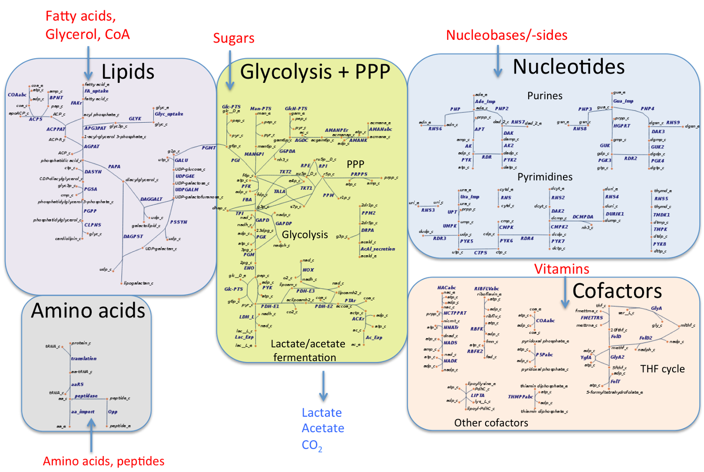 <br>
  <b>Figure 11. Whole Metabolism of JCVI-syn3A with five subsystems: central, nucleotide, lipid, cofactor and amino acid. </b> 
</p>

In our current whole cell modeling, 197 metabolites are included, 148 cytoplasmic and 49 extracellular. 175 reactions connect the metabolites. Shown in the network of central metabolism, the orange nodes are the metabolite IDs. We use suffix '\_c' to denote cytoplasmic and '\_e' for extracellular. The blue arrows are reactions connecting different metabolites, with names in dark blue and related proteins' locusNums under the names. 

ATP as the major energetic molecules energize cellular processes, without which the cell will die. In JCVI-syn3A, glycolysis is the only way to generate ATP. Phosphoenolpyruvate (pep) is an intermediate in both the upstream and downstream in glycolysis.

<p align="center">
  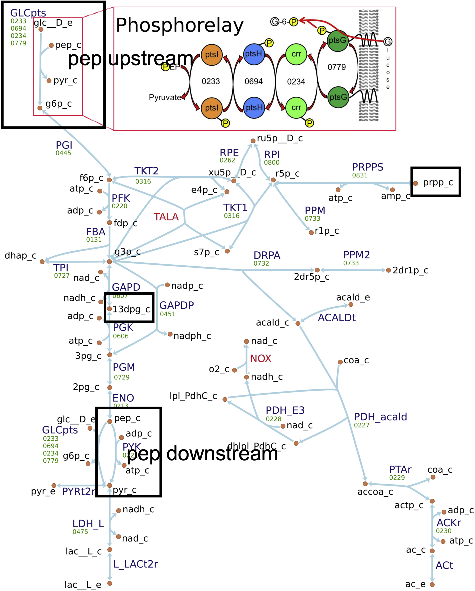 <br>
  <b>Figure 12. Central Metabolism in JCVI-syn3A. Phosphoenolpyruvate (pep) is both the upstream and downstream of glycolysis. 1,3-Bisphosphoglyceric acid (1,3dpg), Phosphoribosyl pyrophosphate (prpp) and pep are in nucleotide metabolism. </b> 
</p>


### Convenience Rate Law

Most reactions in the metabolism requires certain proteins produced in genetic information processes as enzymes or transporters. Convenience rate law and random binding model are used to depict the kinetics of these reactions \cite{liebermeister_bringing_2006}.

The random binding model assumes the substrates bind to the enzyme/transporter in arbitrary order and are converted into the products, which then dissociate from the enzyme in arbitrary order. Convenience rate law further assumes the conversion step is the rate-determining step and the binding reactions are in quasi-equilibrium. For reaction

```math
\ce{A + X <=>[k_f][k_r] B + Y}
```

, the rate law is

<p align="center">
  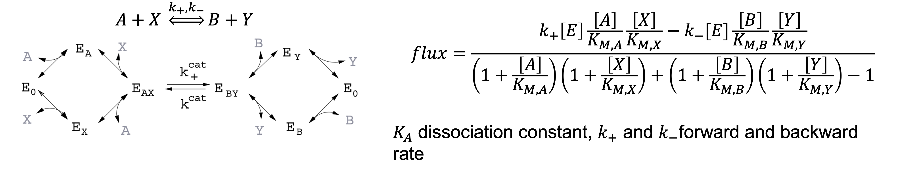 <br>
  <b>Figure 13. Mechanism of reaction A+X to B+Y in random binding model. [E] is the concentration of enzyme, [A] concentration of molecule A </b> 
</p>

The metabolic network is also stored in standard Systems Biology Markup Language (SBML) file. In the given SBML file of JCVI-syn3A, there are two compartments, cellular and extracellular with metabolites and reactions. However, SBML file itself does not store kinetic parameters and we choose to store them in a Excel file with multiple sheets for the simulation.

We can look at one reaction entry in the SBML file for more insights. Go to the SBML file and search DGSNabc. DGSNabc, the irreversible transport of deoxyguanosine (one of RNS ABC import system) in nuclotide metabolism for example, has three reactants and four products with four proteins involved. The geneProductAssociation is AND, meaning four proteins are all needed to perform this reactions. Biologically, four proteins are four sub-units of nucleoside ABC transporter.

## 4. Macromolecular Complex Assembly

In all organisms including Syn3A, key macromolecular complexes mediate essential cellular processes. In genetic information processing, **RNA polymerase (RNAP)** and **ribosomes** decode genetic information into mRNAs and functional proteins via transcription and translation, respectively. **Degradosomes**, a loose complex of endoribonuclease, exoribonuclease, and a few glycolytic enzymes compete with ribosomes for the binding and processing of mRNA. Several essential complexes interact with chromosomes and facilitate chromosome partitioning during cell division[^ref]. The essential metabolism of Syn3A depends on the activated transport of (deoxy)nucleosides, amino acids, vitamins and fatty acids into the cell by membrane complexes with multiple protein subunits[^ref].

In a recent submitted manuscript[^ref], we investigated the assembly of 21 unique macromolecular complexes in the context of the WCM of Syn3A. Complexes’ compositions were determined by cross-checking the existing genome/proteome annotation and the homology-based function annotation. The assembly pathways, as series of bimolecular association reactions, of the ribosome[^ref], RNAP, and ATP synthase were taken as reported, and of others inferred from interactions between subunits.

For example,  **ABC transporters** in Gram-positive organisms have a domain composition of two peripheral nucleotide binding domains (NBD) that provide ATP hydrolysis, two transmembrane domains (TMD) that form the permease channel, and one substrate binding protein (SBP) that delivers substrates to TMDs. The nucleoside ABC transporter rnsBACD comprises 4 distinct subunits of proteins RnsD/0008 (TMD), RnsC/0009 (TMD), RnsA/0010 (2NBDs), and RnsB/0011 (SBP) with 1:1:1:1 stoichiometries, where protein subunit RnsA/0010 correpsonds to two NBDs. The assembly pathways of the ABC transporters were assumed to obey the following order. The TMDs first bind to each other to form the permease channel, and the peripheral NBDs bind to the channel to form the functional core. SBP will bind with the core at last, if separated from the TMDs.

<p align="center">
   <br>
  <b>Figure 14. Typical domain composition of ABC transporter in Gram-positive organisms. SBP: Substrate Binding Protein, TMD: Transmembrane Domain, NBD: Nucleotide Binding Domain. </b> 
</p>

## 5. Hybrid CME-ODE Algorithm

### Step-wise Communication Between CME and ODE

The discreteness and stochasticity of chemical kinetics play a role when the number of reactants is significantly low. This makes it necessary to use stochastic chemical master equation (CME) for genetic information processes (GIP) where the copy numbers of species are low, shown as follows to sample the variation. In contrast, ordinary differential equations (ODE) is sufficient to depict the kinetics of large numbers of small metabolites in metabolism.

```math
\frac{dP(\mathbf{x},t)}{dt}=\sum_{r}^{R} [-a_r({{\mathbf{x}}}) P({{\mathbf{x}}},t) + a_r({{\mathbf{x}}}_\nu-\mathbf{S_r}) P({{\mathbf{x}}}-\mathbf{S_r},t)]
```

To simulate the **co-evolution** of GIP and metabolism, the communication needs to be performed to describe the interactions between these two subsystems. We then proposed to use **[Hybrid CMEODE simulation](https://ietresearch.onlinelibrary.wiley.com/doi/10.1049/iet-syb.2017.0070)**.  We first discretize the entire simulation length into piecewise communication time steps (hook intervals, $t_H$). During each communication time step, 

**(a)** A CME simulation of length $t_H$ is performed to describe the kinetics in GIP. 

**(b)** The communication from CME to ODE by passing the protein counts, the consumption of monomers (dNTP, NTP, and amino acid charged tRNAs), and the recycling of nucleoside monophosphates (NMP) in the degradation of mRNA and recycling of amino acids in the degradation of membrane protein. 

**(c)** Then a $t_H$ length ODE simulation is performed with the updated concentrations of proteins and metabolites. 

**(d)** The impacts of metabolism on GIP are two-fold: the abundance of metabolites explicitly in GIP and the concentrations of monomers that affect the rates of the polymerization of genes, RNAs, and proteins in CME.

<p align="center">
  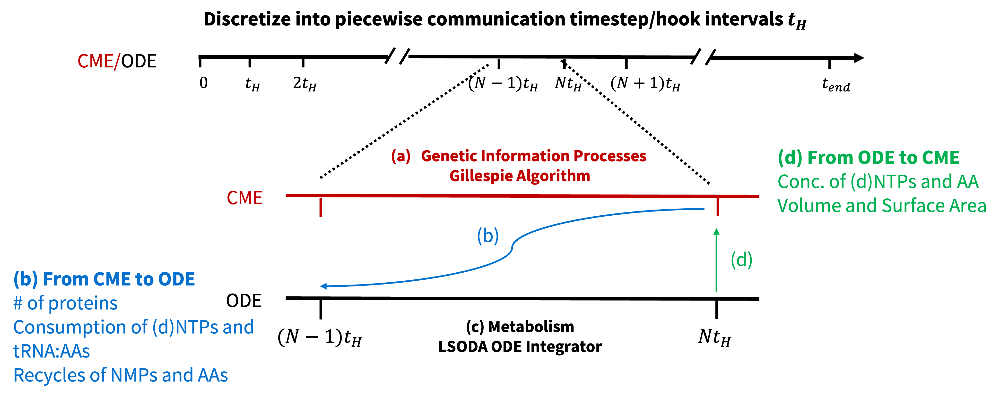 <br>
  <b> Figure 15. Communication between genetic information in CME and metabolism in ODE </b>
</p>

One extra thing to notice is that the CME rates are also updated per second after the metabolism simulation in ODE to account for the possible shortage of monomers that will decrease the rate in genetic information process.


## 6. Analysis and Discussion

### Run Notebook `analysis.ipynb` on Ten Prepared Cell Replicates
+ **First**: Navigate to `.../CME/WCM/analysis` and Open `analysis.ipynb` in Jupyter Notebook Webpage.
  
+ **Second**: Run ALL and Compare the generated plots with figures in this README file.

***The following figures are plotted of ~ 100 cell replicates to make accurate statistics.***

### DNA replication, and Doubling of Cell Volume and Surface Area

We first consider DNA replication and doubling of cell volume and surface area. 

For DNA replication initiation, the on and off rates of DnaA binding to ssDNA during filament formation obtained from smFRET experiments[^ref] were modified from the average quantities ($1\times10^5$ to $1.4\times 10^5 \text{M}^{-1}\text{s}^{-1}$ ) and from (0.55 to 0.42 $\text{s}^{-1}$ ), respectively, that were measured for genetic constructs with DnaA boxes (dsDNA signatures) preceding the ssDNA signatures. The higher DnaA binding rate with ssDNA gives unrealistic fast replication initiation between 0.5 and 2.25 min with the mean of 1 min, which means a very short B period. However, the 4DWCM including the explicit diffusion of DnaA predicted a longer initiation time of mean time 5.5 min[^ref], where some cell replicates requiring 10 min or longer to form the DnaA filament and initiate DNA replication. Changing back to the slower DnaA binding rate in the spatially homogeneous CME-ODE WCM, the expected initiation time recovered
with the median of 5 min. This highlights the influence of diffusion on the cellular behaviors, and the necessity to adopt different parameterization strategies with and without considering diffusion.

There is a wide spread of times when each gene is copied. Starting with only one copy of the chromosome, second copies of genes near the terminus like fakA/0420 are available for transcription after 40 min. On average, the entire chromosome was duplicated around 49 minutes.

<p align="center"> 
     <br>
  <b>Figure 16. Left: Comparison of replication initiation time with fast and slow DnaA binding rate with ssDNA with median of 1 and 5 min, respectively. The median time from 4DWCM is shown by green line.<br> 
  Right: Early replication of Gene 0001 near the <i>Ori</i> and late replication of gene 0420 near the <i>Ter</i>. </b>
</p>

Cell volume doubled at a median time of 67 minutes, after which the partitioning of the chromosomes is assumed to occur. The cell cycle, defined as the time for
surface area to double and the cells to divide, ranged from 93 to 112 with a median of 102 min, which is in good agreement with experimental measured 105 min[^ref].

<p align="center"> 
    <br>
  <b>Figure 17. Scaled chromosome, volume and surface area over the entire cell cycle. </b>
</p>

### Assembly and Activities of RNAP, Ribosome, and Degradosome 

The assembly nearly duplicate the initial 97 RNAPs, 500 ribosomes, and 120 degradosomes. Once the simulation passes the initial transient, the active fractions of RNAP, ribosomes, and degradosomes stabilize at 65%, 73%, and 14%, respectively. The value for RNAP is high compared to the values for naturally occurring bacteria that typically have a larger RNAP to gene ratio. The active ratios maintained at steady-state due to the synchronized assembly of all three complexes along with the cell cycle.

<p align="center"> 
     <br>
  <b>Figure 18. Left:  Distribution of scaled RNAP, ribosome, and degradosome at the end of cell cycle with median of 2.09, 1.81, and 1.77. The dotted lines show the median of distribution.<br> 
  Right: Active ratio of RNAP, ribosome and degradosome over the entire cell cycle. </b>
</p>

### Stochastic Synthesis of Protein and Doubling of Proteome

Here, we revisit the stochastic synthesis of protein. The discreteness and stochasticity of protein synthesis is intrinsic at the single-cell level.
A clear step-like trace of the synthesized protein DnaA/0001 is shown, where the stalled protein synthesis in the horizontal regions corresponded to no ribosomes translating this mRNA. This is the improvement from the simplified gene expression model in last tutorial, where we define the explicit ribosome binding with mRNA. 

Considering the cell division into two daughter cells at the end of the cell cycle, an important metric of WCM Syn3A is whether the protein abundances are duplicated. The averaged scaled protein abundances range from 1.46 to 2.71, with only 32 of the 452 proteins having a value less than 1.8. Two major factor contributing to the span of the distribution are the length of the protein (which should be translated by multiple ribosomes, i.e. polysomes), and the initial proteomics counts.

<p align="center"> 
     <br>
  <b>Figure 19. Left: Stochastic gene expression of DnaA/0001. The left y-axis is the active ribosome translating the mRNA of DnaA/0001, and the right  is the synthesized DnaA/0001 The solid lines represent one single cell replicate, the shaded areas the full range of ten replicates.<br> 
  Right: Distribution of population averaged scaled protein abundance at the end of cell cycle with the median of 2.07. </b>
</p>

### Translation per mRNA

Upon transcription, the fate of the mRNAs is determined by the competition between its binding and translation by ribosomes into a protein, and its binding and degradation by degradosomes into NMPs. If one views the competition between the ribosome and the degradosome as a series of **independent Bernoulli trials**, where success means mRNA binding with the ribosome, and failure binding with the degradosome, then the distribution of the number of successes until the first failure occurs, which is the translations per mRNA transcript until mRNA degradation, follows a geometric distribution with the mean being the ratio of success over loss. The time-dependent ratio of mRNA binding with ribosome over binding over degradosome was calculated using $\frac{k_{bind}^{mRNA:Ribo}\times \# \, Free \, Ribosome}{k_{bind}^{mRNA:Deg}\times \# \, Free \, Degradosome}$. In our current implementations, the ratio between ribosome and degradosome binding rates was 6.3 ($\frac{k_{bind}^{mRNA:Ribo}}{k_{bind}^{mRNA:Deg}}=\frac{8.9\times10^4\, \mathrm{M}^{-1} \mathrm{s}^{-1}}{1.4\times10^4\, \mathrm{M}^{-1} \mathrm{s}^{-1}}=6.3$). The number of available ribosomes over available degradosome was about 1.3 over the cell cycle, which further favor the mRNA to translation instead of degradation ($\frac{\# \, Free \, Ribosome}{\# \, Free \, Degradosome}=\frac{\# Total \ Ribosome \times (1-\% Active \ Ribosome)}{\# Total \ Degradoeoms \times (1-\%Active \ Degradosome)} \approx 1,3$). Thus, the mean of translation per mRNA as $\frac{k_{bind}^{mRNA:Ribo}\times \# \, Free \, Ribosome}{k_{bind}^{mRNA:Deg}\times \# \, Free \, Degradosome}$ was 8.2. From our simulation, the translation events per each unique mRNA transcript were calculated by dividing the number of translated proteins by the transcribed mRNAs. The distribution ranged from 4.8 to 11, with a prominent peak around 7.7 that was close to the calculated 8.2 in Figure~S7(h).

<p align="center"> 
     <br>
  <b>Figure 19. Left: Ratio of mRNA binding to ribosome over binding to degradosome. The population averaged ratio is 8.2 at steady-state. <br> 
  Right: Distribution of  </b>
</p>

### Slowdown of GIP

The monomer pool regenerated in metablism could drain due to the slow systhesis or overconsumption. For transcription, the low concentrations of UTP slowes down the elongation of RNAs by 20% on average. In certain replicates, the rate can be zero to halt synthesis of RNAs for short time periods if UTP is all used up, and then recover after the UTP resupplied in nucleotide metabolism.

<p align="center"> 
   <br>
  <b>Figure 20. Low UTP concentration supplied from nucleotide metabolism slows down transcription elongation</b>
</p>