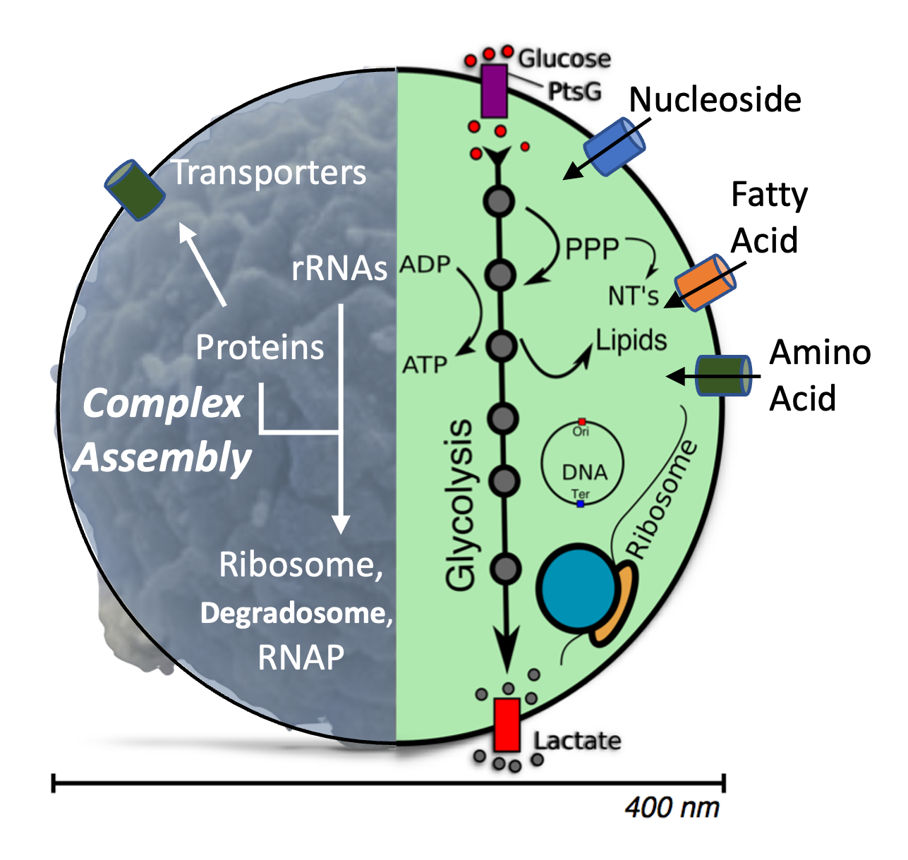
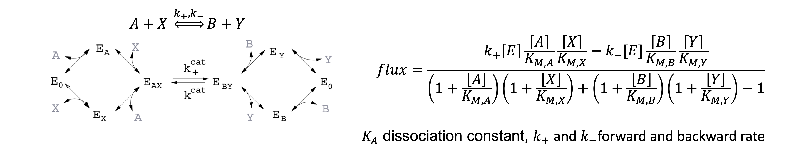

# CME-ODE Whole-Cell Model of a Genetically Minimal Cell, JCVI-Syn3A

Now, we are at the last tutorial, the CME-ODE WCM of Syn3A.

## Outline:
1. [Run CME/ODE Whole-Cell Model in Parallel](#1-run-cmeode-whole-cell-model-in-parallel)
2. [Minimal Genome and Genetic Information Processes](#2-minimal-genome-and-genetic-information-processes)
3. [Essential Metabolism](#3-essential-metabolism)
4. [Macromolecular Complex Assembly](#4-macromolecular-complex-assembly)
5. [Hybrid CME-ODE Algorithm](#5-hybrid-cme-ode-algorithm)
6. [Analysis and Discussion](#6-analysis-and-discussion)

## 1. Run CME/ODE Whole-Cell Model in Parallel

To capture statistically meaningful cellular dynamics, we simulate multiple independent cell replicates. To accelerate this process, running the simulations in parallel is essential. In our current setup, we use the `mpirun` module to launch the Python simulation scripts in parallel.

For each independent cell replicate, the main script `WCM_CMEODE_Hook.py` coordinates the workflow by calling multiple Python scripts to construct and simulate genetic information processes, metabolism, and their communication over the entire cell cycle.

The CME simulation is performed using LM with the Direct Gillespie Algorithm. We incorporate the `hookSimulation` function to interrupt the CME timeline at specified intervals and enable communication with the ODE solver.

For the ODE simulation, we use **[odecell](https://github.com/Luthey-Schulten-Lab/odecell)**, a software developed by the Luthey-Schulten Lab. This tool translates metabolic reactions into a system of ordinary differential equations and assigns appropriate kinetic parameters. The resulting ODE system is then solved using the *LSODA* algorithm from the SciPy library.

### Scripts and Program Flowchart

---

<details open> 
<summary><strong>Click to COLLAPSE: Explanation of All Scripts </strong></summary>

#### Launch Simulation in Parallel

- `mpirun.sh` — Bash file to specify the time length, number of replicates, and communication interval

#### Main Driver

- `WCM_CMEODE_Hook.py` — Main script to launch the CMEODE simulation.

#### Simulation Core

- `initiation.py` — Initializes constants, time traces, and cell states.
- `species_counts.py` — Python Class for managing species count data in the hook algorithm.
- `integrate.py` — Performs ODE integration using *lsoda* from Scipy.
- `communicate.py` — Syncs CME and ODE states, computes costs, and updates the membrane.
- `hookSolver_CMEODE.py` — Defines `hookSimulation`, the main hook interval operation.
- `hook_CMEODE.py` — Manages operations that communicate CME and ODE during hooks.
- `filesaving.py` — Exports time traces, surface area, and fluxes to CSV files.

#### Biology Modules

- `rxns_CME.py` — Adds genetic information process (GIP) reactions to CME (e.g., replication, transcription, translation, tRNA charging).
- `replication.py` — Defines DNA replication initiation and reactions (GIP parameter from `kinetic_params.xlsx`).
- `GIP_rates.py` — Computes reaction rates for GIP processes (GIP parameter from `kinetic_params.xlsx`).
- `rxns_ODE.py` — Builds the ODE system using `odecell` (metabolic parameters from `kinetic_params.xlsx`).
- `cme_complexation.py` — Adds protein complex formation reactions to CME.

</details>

<!-- <p align="center">
   <br>
  <b>Figure 1. Launching Independent Whole Cell Simulations in Parallel using mpirun module. The user input will be passed to claim the replicates number, time length, and hook interval.</b> <br>
  <b>Each simulation is independent with each other. In current simulation we have four main input files and the trajectories will be stored in CSV files with an additional log file.</b>
</p> -->

---

<p align="center">
   <br>
  <b> Figure 1. Flowchart of one simulation instance of CME-ODE WCM of Syn3A</b>
</p>

### Launch Four Cell Replicates

The spatially homogeneous simulations can be efficiently parallelized across up to 25 independent cell replicates or more, with each replicate requiring less than 2 GB of RAM. On systems equipped with AMD EPYC 7763 “Milan” processors on **[Delta](https://docs.ncsa.illinois.edu/systems/delta/en/latest/index.html)**, or Intel Xeon Gold 6154 CPUs @ 3.00 GHz on a standard workstation, a 2-hour biological simulation with 1-second communication intervals typically completes within **6 physical hours**.

Due to time constraints, you will run a 2-minute simulation with 4 cell replicates. You are encouraged to modify the parameters to run longer simulations or more replicates.

---

+ **First**: Open **another** terminal window and log in to Delta again.

+ **Second**: Navigate to the program directory and submit the batch script:

    ```bash
    cd /projects/beyi/$USER/CME/WCM/programs
    sbatch sbatch.sh
    ```

> [!NOTE]
> The `sbatch.sh` script executes the `mpirun.sh` script, which launches the parallel CME-ODE whole-cell model simulations using `mpirun`.

+ **Third**: Check the status of your submitted job:

    ```bash
    squeue -u $USER
    ```

    - `PD` indicates the job is pending.
    - `R` means it is currently running.
    - If the job disappears from the list, it has finished.

    Then, list the output files under the `output_4replicates` folder:

    ```bash
    ls ../output_4replicates
    ```

---

Each simulation replicate with index *i* will generate the following output files:

- `counts_i.csv`: Time trajectories of species counts for metabolites (ODE) and genetic particles (CME), in units of molecules.
- `SA_i.csv`: Time trajectories of surface area (nm² or m²) and volume (L).
- `Flux_i.csv`: Time trajectories of fluxes through ODE reactions, in units of mM/s.
- `log_i.txt`: Log file including timestamps, reaction prints, runtime, and any warnings or errors.

All output files are saved to the directory `../output_4replicates/`, which is defined and created in `mpirun.sh`. For a 7200-second simulation with 1-second hook intervals, the typical CSV file size ranges from **100–200 MB**.

### Input Files

Four main input files are used in the whole-cell simulation: one GenBank file, one SBML file, and two Excel files. The `syn3A.gb` GenBank file contains the sequences and functional annotations of genes, RNAs, and proteins. The `Syn3A_updated.xml` SBML file encodes the metabolic reactions, including [gene-protein-reaction rules](https://pubmed.ncbi.nlm.nih.gov/34748537/) and stoichiometries. The `initial_concentration.xlsx` file provides the initial counts/concentrations of proteins and metabolites, while `kinetic_params.xlsx` contains the kinetic parameters for genetic information processing (GIP) and metabolic reactions.

---

<details open>
<summary><strong>Click to COLLAPSE: Breakdown of Input Files</strong></summary>

- `syn3A.gb` — GenBank file for JCVI-syn3A  
  - Retrieved from [NCBI Accession: CP016816](https://www.ncbi.nlm.nih.gov/nuccore/CP016816).  
  - Contains genome sequence, segmentation, and gene annotations.

- `Syn3A_updated.xml` — SBML (Systems Biology Markup Language) file describing the metabolic system  
  - Includes metabolites, compartments, reactions, and gene associations.  
  - Updated model from [*eLife*, 2019](https://elifesciences.org/articles/36842).  
  - Parsed for reactions and stoichiometries by `rxns_ODE.py`.

- `initial_concentration.xlsx` — Initial conditions for proteins, medium, and metabolites  
  - Updated from [*Cell*, 2022](https://www.sciencedirect.com/science/article/pii/S0092867421014884?via%3Dihub#da0010).  
  - **Sheets**:
    - **Comparative Proteomics**: Protein initial counts for CME.
    - **Simulation Medium**: Medium composition for simulation.
    - **Intracellular Metabolites**: Cytoplasmic metabolite concentrations for ODE.
    - **mRNA Count**: Average initial mRNA counts for CME.
    - **Protein Metabolites**: IDs used in `initiation.py` and `rxns_ODE.py`.

- `kinetic_params.xlsx` — Kinetic parameters for ODE and CME reactions  
  - Updated from [*Cell*, 2022](https://www.sciencedirect.com/science/article/pii/S0092867421014884?via%3Dihub#da0010).  
  - **Sheets**:
    - **Central, Nucleotide, Lipid, Cofactor, Transport**: Random binding + convenience kinetics (`rxns_ODE.py`).
    - **Non-Random-binding Reactions**: Passive transport and phosphorelay (`rxns_ODE.py`).
    - **tRNA Charging**: Aminoacylation parameters (`rxns_CME.py`).
    - **Gene Expression**: Parameters for gene expression (`rxns_CME.py`, `replication.py`, `GIP_rates.py`).
    - **SSU Assembly, LSU Assembly**: Reactions and rates for ribosomal subunit assembly.

- `complex_formation.xlsx` — Defines protein complex composition and initial copy numbers.

</details>

---

We now focus on gene **JCVISYN3A_0011** to illustrate how the input files work together in our simulation.

The genome of JCVI-syn3A is stored in a standard GenBank file available from [NCBI (Accession: CP016816.2)](https://www.ncbi.nlm.nih.gov/nuccore/CP016816.2/). GenBank files contain far more than nucleotide sequences—they include feature annotations, coding regions, protein translations, and more.

Open the GenBank file in `.../input_data/` with a text editor and search for **JCVISYN3A_0011**. You'll see the entry shown below. **JCVISYN3A_0011** is the locus tag for a protein-coding gene, where the prefix identifies the organism (JCVI-syn3A) and `0011` is the locus number—heavily used in the model to distinguish genes, RNAs, and proteins. This gene spans nucleotides 15153 to 16799. Its product is a *Nucleoside Transporter ABC substrate-binding protein*, part of a ribonucleoside ABC transporter complex that imports nucleosides into Syn3A.

<p align="center">
   <br>
  <b>Figure 2. Entry for JCVISYN3A_0011 in Syn3A's GenBank file</b>
</p>

The SBML file encodes the entire metabolic model of Syn3A, including compartments (e.g., cytoplasm, extracellular), species, reactions, gene products (enzymes or transporters), and objectives (for FBA). It does not include rate constants; those are specified in `kinetic_params.xlsx`.

open the SBML file and search for the reaction *DGSNabc*. **JCVISYN3A_0011** participates in the reaction *DSGNabc*, which irreversibly transports deoxyguanosine as part of nucleotide metabolism. In the SBML file (see Figure 3), DSGNabc is marked as irreversible (`reversible=false`) and involves 3 reactants and 4 products. The `geneProductAssociation` is an *and* rule: all four subunits (**0008, 0009, 0010, and 0011**) must assemble for the transporter to function. In the current whole-cell model, we model the assembly of 21 unique protein complexes, including this one, named **rnsBACD**. The ODE solver uses the actual abundance of such assembled complexes in metabolic simulations.

<p align="center">
   <br>
  <b>Figure 3. DSGNabc reaction entry in the SBML file</b>
</p>

The kinetic constants for the DSGNabc reaction, as defined in `kinetic_params.xlsx`, are shown below.

<p align="center">
   <br>
  <b>Figure 4. Kinetic constants for the DSGNabc reaction from kinetic_params.xlsx</b>
</p>


## 2. Minimized Genome and Genetic Information Processes

### Genetically Minimized Bacterium: JCVI-syn3A

The minimal cell **JCVI-syn3A** is a synthetic bacterium derived from the parent organism *Mycoplasma mycoides* subsp. *capri*, and was published by the J. Craig Venter Institute in 2016[^hutchison_design]. JCVI-syn3A has a doubling time of approximately 2 hours and consistently forms spherical cells with a radius of ~200 nm.

JCVI-syn3A possesses the smallest genome among autonomously replicating organisms, measuring 543 kbp and encoding 452 protein-coding genes and 38 RNA genes. Remarkably, only 90 of the 452 protein-coding genes are of unknown function—a lower fraction than observed in other well-studied organisms such as *Saccharomyces cerevisiae* and *Escherichia coli*[^breuer_metabolism].

<p align="center">
   
   
  <br>
  <b>Figure 5. Left: Annotated protein-coding genes in JCVI-syn3A, with fewer than 90 of unknown function. <br>
  Right: A visual summary of JCVI-syn3A’s genetic information processes, complex formation, and metabolism.</b>
</p>

### Genetic Information Processes

Genetic information processes link the genetic blueprint encoded in DNA to functional proteins. In our current whole-cell model of the minimal cell, we include key processes, as outlined in the table below.

**Replication** duplicates the genetic material and is regulated through replication initiation. **Transcription** copies the sequence information from DNA to RNA, producing three types of RNA: mRNA, rRNA, and tRNA. These RNA species are tightly interconnected with **translation**, which takes place on ribosomes. During translation, the mRNA is read and used to assemble amino acid chains into proteins. **rRNA**, together with ribosomal proteins, forms ribosomes through the process of **ribosomal biogenesis**[^earnest_ribosome_2015]. **tRNA** serves as the adaptor and carrier of amino acids to the ribosome.

<p align="center">
   <br>
  <b>Figure 6. Left: Genetic information flow. <br>
  Right: Functions of genetic information processing (GIP) reactions.</b> 
</p>

In this whole-cell model, translation and degradation are modeled with greater precision than in Tutorial 2. Each reaction involves the binding of mRNA to a complex machinery—either a ribosome for translation or a degradosome for degradation. As one of the most active molecular species in genetic information processing, mRNA is subject to degradation upon binding to the degradosome. This competition between ribosome and degradosome binding serves as an important regulatory mechanism in gene expression, which we will explore in the results section.

**Replication initiation** is modeled as the binding of the multi-domain protein **DnaA** (encoded by gene *JCVISYN3A_0001*) and the replisome to a specific chromosomal region known as **oriC**[^thornburg_kinetic].

<p align="center">
   <br>
  <b>Figure 7. Left: oriC region—nine-nucleotide DnaA-binding signatures (yellow and red) and AT-rich region (grey). <br>
  Right: PDB structures showing DnaA binding: (a) Domain IV (PDB: 1J1V), (b) Domain III (PDB: 3R8F).</b> 
</p>

The initiation process has three stages:

1. **Domain IV of DnaA** binds to three nine-nucleotide signature sequences on the double-stranded DNA (shown in red and yellow).
2. This opens a pocket for **Domain III of DnaA** to bind the adjacent AT-rich single-stranded region, forming a DnaA filament.
3. Once the filament exceeds 20 DnaA molecules (up to 30 maximum, due to the 90 nt AT-rich region), the **replisome** binds and initiates replication.  
   <!-- *(Note: Replisome assembly is not explicitly modeled in the current version.)* -->

<p align="center">
   <br>
  <b>Figure 8. Three-stage model of DNA replication initiation.</b> 
</p>

Replication proceeds gene-by-gene as the replisomes travel bidirectionally from oriC to ter along the circular chromosome. Since gene locations are fixed, replication occurs in a predefined, ordered sequence. Thus, our model implements **ordered and bidirectional** replication.

<p align="center">
   <br>
  <b>Figure 9. Ordered and bidirectional replication in JCVI-syn3A.</b> 
</p>

The corresponding reactions for gene duplication are listed in Table 1. The replication rates in Table 2 follow the polymerization rate law proposed by Hofmeyr *et al.*[^hofmyer_rate].

**Table 1: Reactions and Rates for Replication, Transcription, Translation and Degradation**

| **Processes**   | **Reactions**                                                                                      | **Kinetic Constant**                                 |
|-----------------|---------------------------------------------------------------------------------------------------|------------------------------------------------------|
| Replication     | G<sub>locusNum</sub> → 2G<sub>elongation</sub>                                                     | $k_{\text{replication}}^{\text{locusNum}}$        |
| Transcription   | RNAP + G<sub>locusNum</sub> → RNAP:G<sub>locusNum</sub>                                            | $k_{\text{trsc}}^{\text{binding}}$                 |
|                 | RNAP:G<sub>locusNum</sub> → R<sub>locusNum</sub> + RNAP + G<sub>locusNum</sub>                     | $s_{\text{trsc}}^{\text{locusNum}} k_{\text{trsc}}^{\text{elongation}}$ |
| Translation     | Ribosome + R<sub>locusNum</sub> → Ribosome:R<sub>locusNum</sub>                                    | $k_{\text{trans}}^{\text{binding}}$               |
|                 | Ribosome:R<sub>locusNum</sub> → P<sub>locusNum</sub> + Ribosome + R<sub>locusNum</sub>             | $k_{\text{trans}}^{\text{binding}}$             |
| Degradation     | Degradosome + R<sub>locusNum</sub> → Degradosome:R<sub>locusNum</sub>                              | $k_{\text{degra}}^{\text{binding}}$                |
|                 | Degradosome:R<sub>locusNum</sub> → NMPs + Degradosome                                              | $k_{\text{degra}}^{\text{depoly}}$                 |

Transcription, translation and degradation are all depicted as a two-step binding and (de)polymerizatoin reactions, where the polymerizations to synthesize RNAs and proteins share the same rate form as gene replication. The rate for complete degradation from a mRNA to its monomers is calculated by divide the monomer depletion rate over the length of mRNA.

**Table 2: Rate Form for Replication, Transcription, Translation and Degradation**

| **Processes**   | **(De)polymerization Constants**                  | **Formulation**                                                                                                                                  |
|-----------------|---------------------------------------------------|--------------------------------------------------------------------------------------------------------------------------------------------------|
| Replication     | $k_{\text{elongation}}^{\text{replication}}$      | $\dfrac{k_{\text{replication}}^{\text{cat}}}{\dfrac{K_{D1} K_{D2}}{[dNTP_1][dNTP_2]} + \sum_i \dfrac{K_{Di}}{[dNTP_i]} + L_{\text{DNA}} - 1}$     |
| Transcription   | $k_{\text{elongation}}^{\text{trsc}}$             | $\dfrac{k_{\text{transcription}}^{\text{cat}}}{\dfrac{K_{D1} K_{D2}}{[NTP_1][NTP_2]} + \sum_i \dfrac{K_{Di}}{[NTP_i]} + L_{\text{RNA}} - 1}$     |
| Translation     | $k_{\text{elongation}}^{\text{trans}}$            | $`\dfrac{k_{\text{translation}}^{\text{cat}}}{\dfrac{K_{D1} K_{D2}}{[tRNA:aa_1][tRNA:aa_2]} + \sum_i \dfrac{K_{Di}}{[\text{tRNA:aa}_i]} + L_{\text{protein}} - 1}`$ |
| Degradation     | $k_{\text{depoly}}^{\text{degra}}$                | $\dfrac{k_{\text{cat}}^{\text{degra}}}{L_{\text{mRNA}}}$                                                                                        |

## 3. Essential Metabolism and Rate Law

### Essential Metabolism

As discussed earlier, replication, transcription, and translation all require monomers—deoxyribonucleotides (dNTPs), ribonucleotides (NTPs), and amino acids (AAs)—to carry out polymerization reactions.

All of these monomers are supplied by the metabolic network of JCVI-syn3A. The (d)NTPs are produced through nucleotide metabolism, which includes both the import of extracellular nucleosides and their subsequent conversion into (d)NTPs for DNA and RNA synthesis. Other essential intermediates—such as phosphoribosyl pyrophosphate (PRPP), phosphoenolpyruvate (PEP), and 1,3-bisphosphoglyceric acid (1,3BPG)—are generated via glycolysis in central metabolism.

<p align="center">
   <br>
  <b>Figure 10. Supply of GTP and dGTP for nucleic acid synthesis in nucleotide metabolism. Metabolites in brackets are sourced from central metabolism.</b> 
</p>

The overall metabolic network is organized into five interconnected subsystems: central metabolism, nucleotide metabolism, lipid metabolism, cofactor metabolism, and amino acid metabolism. Glucose 6-phosphate (G6P), a key glycolysis intermediate, connects central and lipid metabolism. ATP, generated via glycolysis, serves as the universal energy carrier and powers reactions across all five subsystems.

<p align="center">
   <br>
  <b>Figure 11. Metabolic network of JCVI-syn3A, including central, nucleotide, lipid, cofactor, and amino acid subsystems.</b> 
</p>

In our current whole-cell model, 197 metabolites are included: 148 cytoplasmic and 49 extracellular. These are connected by 175 reactions. In the network diagram of central metabolism, orange nodes represent metabolites (with `_c` and `_e` suffixes denoting cytoplasmic and extracellular locations, respectively). Blue arrows represent reactions, annotated with reaction names (in dark blue) and the locus tags of related proteins.

ATP is the key energy currency for the cell; without it, cellular processes cannot proceed. In JCVI-syn3A, ATP is generated exclusively through glycolysis. Phosphoenolpyruvate (PEP) is a key intermediate found in both upstream and downstream glycolytic reactions.

<p align="center">
   <br>
  <b>Figure 12. Central metabolism of JCVI-syn3A. PEP participates in both upstream and downstream glycolysis. PRPP, 1,3BPG, and PEP also appear in nucleotide metabolism.</b> 
</p>

### Convenience Rate Law

Most metabolic reactions require enzymes or transporters that are products of genetic information processes. To describe their kinetics, we use the **convenience rate law** and **random binding model**[^liebermeister_convenience].

The **random binding model** assumes that substrates bind to an enzyme or transporter in arbitrary order, are converted into products, and then dissociate in arbitrary order. The **convenience rate law** simplifies this by assuming that substrate binding is at quasi-equilibrium and the conversion step is rate-limiting. For a general reaction:

```math
\ce{A + X <=>[k_f][k_r] B + Y}
```

, the rate law is expressed as follows:

<p align="center">
   <br>
  <b>Figure 13. Mechanism of reaction A+X to B+Y in random binding model. [E] is the concentration of enzyme, [A] concentration of molecule A </b> 
</p>

## 4. Macromolecular Complex Assembly

In all organisms, including JCVI-syn3A, key macromolecular complexes mediate essential cellular processes. Within genetic information processing, **RNA polymerase (RNAP)** and **ribosomes** carry out transcription and translation, respectively—decoding DNA into mRNA and then into proteins. **Degradosomes**, loosely organized complexes composed of endoribonucleases, exoribonucleases, and certain glycolytic enzymes, compete with ribosomes for mRNA binding and processing. Additionally, several essential complexes interact with chromosomes to facilitate chromosome segregation during cell division[^gilbert_dynamics]. Syn3A’s essential metabolism also relies on the active transport of (deoxy)nucleosides, amino acids, vitamins, and fatty acids into the cell via membrane-bound complexes composed of multiple protein subunits[^breuer_metabolism].

In a recently submitted manuscript[^fu_complex], we investigated the assembly of 21 unique macromolecular complexes in the context of Syn3A’s whole-cell model. Complex compositions were determined by cross-referencing genome/proteome annotations and homology-based functional assignments. Assembly pathways—modeled as sequences of bimolecular association reactions—were either taken from prior studies (e.g., ribosome[^earnest_ribosome_2015], RNAP, ATP synthase) or inferred based on known subunit interactions.

The **bacterial ribosome** consists of a small subunit (30S SSU) and a large subunit (50S LSU), each of which assembles independently as ribonucleoprotein complexes. In Syn3A, rRNA operons (*rrsA*/0069, *rrlA*/0068, *rrfA*/0067 and *rrsB*/0534, *rrlB*/0533, *rrfB*/0532) encode the 16S, 23S, and 5S rRNAs, respectively. The 16S rRNA and 20 SSU ribosomal proteins form the SSU; the 23S and 5S rRNAs with 31 LSU ribosomal proteins form the LSU.

In our current model, SSU assembly pathways were adapted from Earnest *et al.*[^earnest_ribosome_2015], reducing the number of intermediates from 145 to 19 by retaining only the most flux-efficient routes (Figure 14(a)). For the LSU, a linear assembly pathway was sampled from the rerouted Nierhaus assembly map[^davis_LSU]. SSUs and LSUs eventually associate at a rapid rate to form intact ribosomes, which then bind mRNA to initiate translation.

**ABC transporters** in Gram-positive organisms follow a domain architecture consisting of (Figure 14 (b)):
- Two peripheral **nucleotide-binding domains (NBDs)** that hydrolyze ATP,
- Two **transmembrane domains (TMDs)** that form the permease channel,
- One **substrate-binding protein (SBP)** that delivers substrates to the TMDs.

The nucleoside ABC transporter rnsBACD comprises 4 distinct subunits of proteins RnsD/0008 (TMD), RnsC/0009 (TMD), RnsA/0010 (2NBDs), and RnsB/0011 (SBP) with 1:1:1:1 stoichiometries, where protein subunit RnsA/0010 correpsonds to two NBDs. The assembly pathways of the ABC transporters were assumed to obey the following order. The TMDs first bind to each other to form the permease channel, and the peripheral NBDs bind to the channel to form the functional core. SBP will bind with the core at last, if separated from the TMDs. As a complete complex, rnsBACD import nucleosides, such as guanosine and deoxyguanosine.

<p align="center">
   <br>
  <b>Figure 14. (a): Hierarchical and parallel SSU assembly pathway with 145 intermediates. The green-marked pathway highlights the reduced model with 19 high-flux intermediates. <br> 
  (b): Typical domain architecture of ABC transporters in Gram-positive bacteria. SBP: Substrate Binding Protein, TMD: Transmembrane Domain, NBD: Nucleotide Binding Domain. <br>
  (c): Nucleotide metabolism of GTP and dGTP with reactions catalyzed by protein complexes circled. ABC transporter rnsBACD import guanosine and deoxyguanosine in GSNabc and DGSNabc reactions.</b> 
</p>

## 5. Hybrid CME-ODE Algorithm

### Step-wise Communication Between CME and ODE

The discreteness and stochasticity of chemical kinetics play a role when the number of reactants is significantly low. This makes it necessary to use stochastic chemical master equation (CME) for genetic information processes (GIP) where the copy numbers of species are low, shown as follows to sample the variation. In contrast, ordinary differential equations (ODE) is sufficient to depict the kinetics of large numbers of small metabolites in metabolism.

```math
\frac{dP(\mathbf{x},t)}{dt}=\sum_{r}^{R} [-a_r({{\mathbf{x}}}) P({{\mathbf{x}}},t) + a_r({{\mathbf{x}}}_\nu-\mathbf{S_r}) P({{\mathbf{x}}}-\mathbf{S_r},t)]
```

To simulate the **co-evolution** of GIP and metabolism, the communication needs to be performed to describe the interactions between these two subsystems. We then proposed to use a hybrid CME-ODE simulation[^bianchi_CMEODE]. We first discretize the entire simulation length into piecewise communication time steps (hook intervals, $t_H$). During each communication time step, 

**(a)** A CME simulation of length $t_H$ is performed to describe the kinetics in GIP. 

**(b)** The communication from CME to ODE by passing the protein counts, the consumption of monomers (dNTP, NTP, and amino acid charged tRNAs), and the recycling of nucleoside monophosphates (NMP) in the degradation of mRNA and recycling of amino acids in the degradation of membrane protein. 

**(c)** Then a $t_H$ length ODE simulation is performed with the updated concentrations of proteins and metabolites. 

**(d)** The impacts of metabolism on GIP are two-fold: the abundance of metabolites explicitly in GIP and the concentrations of monomers that affect the rates of the polymerization of genes, RNAs, and proteins in CME.

<p align="center">
   <br>
  <b> Figure 15. Communication between genetic information in CME and metabolism in ODE </b>
</p>

One extra thing to notice is that the CME rates are also updated per second after the metabolism simulation in ODE to account for the possible shortage of monomers that will decrease the rate in genetic information process.

## 6. Analysis and Discussion

### Run Notebook `analysis.ipynb` on Ten Prepared Cell Replicates

+ **First**: Open `analysis.ipynb` in Jupyter Notebook Interface under directory `/CME/WCM/analysis/`.
  
+ **Second**: Run ALL and Compare the generated plots with figures in this README file.

***The following figures are plotted of ~ 100 cell replicates to make accurate statistics.***

### DNA Replication, and Doubling of Cell Volume and Surface Area

We begin by examining DNA replication and the doubling of cell volume and surface area.

For replication initiation, the on- and off-rates of DnaA binding to ssDNA during filament formation—originally obtained from smFRET experiments[^cheng_DnaA]—were modified from their reported averages (from $1 \times 10^5$ to $1.4 \times 10^5 \, \mathrm{M}^{-1}\mathrm{s}^{-1}$ for binding, and from 0.55 to 0.42 $\mathrm{s}^{-1}$ for unbinding). These values were derived from genetic constructs in which DnaA boxes (dsDNA signatures) precede the ssDNA binding region.

Using the higher DnaA binding rate led to unrealistically fast replication initiation (between 0.5 and 2.25 minutes, median 1 minute), implying a very short B period. In contrast, the 4D whole-cell model (4DWCM), which explicitly considers DnaA diffusion, predicted a longer mean initiation time of 5.5 minutes, with some cells requiring over 10 minutes[^thornburg_maytin_4DWCM]. Reverting to the slower DnaA binding rate in the spatially homogeneous CME-ODE WCM restored realistic initiation times, with a median of 5 minutes. This highlights the impact of spatial diffusion on cellular behavior and the need for different parameterizations when diffusion is (or is not) modeled.

Gene replication times varied widely. With only one initial copy of the chromosome, genes near the terminus—like *fakA/0420*—became available for transcription only after 40 minutes. On average, the entire chromosome was replicated by 49 minutes.

<p align="center"> 
   
   <br>
  <b>Figure 16. Left: Comparison of replication initiation times with fast and slow DnaA binding rates (medians: 1 min and 5 min). Green line indicates the median from 4DWCM. <br> 
  Right: Early replication of gene *0001* near the <i>oriC</i> and late replication of gene *0420* near the <i>terC</i>.</b>
</p>

Cell volume doubled at a median of 67 minutes, after which chromosome partitioning was assumed. The full cell cycle—defined by surface area doubling and division—ranged from 93 to 112 minutes, with a median of 102 minutes, consistent with the experimentally measured value of 105 minutes[^pelletier_division].

<p align="center"> 
    <br>
  <b>Figure 17. Scaled progression of chromosome replication, volume, and surface area over the cell cycle.</b>
</p>

---

### Assembly and Activity of RNAP, Ribosomes, and Degradosomes

The model closely reproduced the initial counts of RNAP (97), ribosomes (500), and degradosomes (120). After an initial transient, the active fractions stabilized at 65% for RNAP, 73% for ribosomes, and 14% for degradosomes. The RNAP activity level is relatively high compared to that of natural bacteria, which typically have a higher RNAP-to-gene ratio. The synchronization of complex assembly across the cell cycle contributed to the steady-state activity levels.

<p align="center"> 
   
   <br>
  <b>Figure 18. Left: Distribution of final scaled abundances for RNAP, ribosome, and degradosome (medians: 2.09, 1.81, and 1.77). <br> 
  Right: Active fractions of RNAP, ribosomes, and degradosomes throughout the cell cycle.</b>
</p>

---

### Stochastic Synthesis of Proteins and Doubling of the Proteome

Protein synthesis is intrinsically stochastic at the single-cell level. A clear stepwise synthesis trace for protein DnaA/0001 is shown below. The horizontal plateaus reflect periods where no ribosomes were actively translating the mRNA. This improvement over previous models arises from explicitly modeling ribosome binding to mRNA.

To support symmetric cell division, proteins must be approximately doubled. The population-averaged scaled protein abundances ranged from 1.46 to 2.71, with only 32 out of 452 proteins falling below 1.8. Variation in duplication efficiency was influenced by protein length (which affects polysome usage) and initial proteomics counts.

<p align="center"> 
   
    <br>
  <b>Figure 19. Left: Stochastic synthesis of DnaA/0001. Solid lines represent one replicate; shaded regions represent the full range over 10 replicates. <br> 
  Right: Distribution of scaled protein abundances at the end of the cell cycle (median: 2.07).</b>
</p>

---

### Translation per mRNA

Upon transcription, each mRNA faces a competition: bind to a ribosome and be translated, or bind to a degradosome and be degraded. If this competition is modeled as a sequence of **Bernoulli trials**—with "success" being translation and "failure" being degradation—the number of translations per mRNA follows a **geometric distribution** with the mean being the ratio of success over failure.

The ratio of mRNA binding with ribosome over binding over degradosome was calculated using $`\frac{k_{bind}^{mRNA:Ribo}\times \# \, Free \, Ribosome}{k_{bind}^{mRNA:Deg}\times \# \, Free \, Degradosome}`$. In our current implementations, the ratio between ribosome and degradosome binding rates was 6.3 ($`\frac{k_{bind}^{mRNA:Ribo}}{k_{bind}^{mRNA:Deg}}=\frac{8.9\times10^4\, \mathrm{M}^{-1} \mathrm{s}^{-1}}{1.4\times10^4\, \mathrm{M}^{-1} \mathrm{s}^{-1}}=6.3`$). The number of available ribosomes over available degradosome was about 1.3 over the cell cycle, which further favor the mRNA to translation instead of degradation ($`\frac{\# \, Free \, Ribosome}{\# \, Free \, Degradosome}=\frac{\# Total \ Ribosome \times (1-\% Active \ Ribosome)}{\# Total \ Degradoeoms \times (1-\%Active \ Degradosome)} \approx 1,3`$). Thus, the mean of translation per mRNA as $`\frac{k_{bind}^{mRNA:Ribo}\times \# \, Free \, Ribosome}{k_{bind}^{mRNA:Deg}\times \# \, Free \, Degradosome}`$ was 8.2. 

From our simulation results, the number of translation events per unique mRNA transcript was computed by dividing the total number of translated proteins by the total number of transcribed mRNAs. The resulting distribution ranged from 4.8 to 11, with a prominent peak around 7.7—closely matching the theoretical estimate of 8.2.

<p align="center"> 
     <br>
  <b>Figure 20. Left: Ratio of mRNA binding to ribosome over binding to degradosome. The population averaged ratio is 8.2 at steady-state. <br> 
  Right: Distribution of translation per mRNA for 455 unique mRNAs with median 7.76 marked by purple dotted line. </b>
</p>

---

### Slowdown of GIP

Monomer pools regenerated via metabolism can become temporarily depleted due to insufficient synthesis or overconsumption. For example, low UTP concentrations caused transcription elongation rates to slow down by an average of 20%. In some replicates, transcription briefly halted due to UTP depletion and resumed once levels recovered via nucleotide metabolism.

<p align="center"> 
   <br>
  <b>Figure 21. Low UTP concentration supplied from nucleotide metabolism slows down transcription elongation</b>
</p>

---

## References:

[^hutchison_design]: Hutchison, C. A., Chuang, R., Noskov, V. N., Assad-Garcia, N., Deerinck, T. J., Ellisman, M. H., Gill, J., Kannan, K., Karas, B. J., Ma, L., Pelletier, J. F., Qi, Z., Richter, R. A., Strychalski, E. A., Sun, L., Suzuki, Y., Tsvetanova, B., Wise, K. S., Smith, H. O., . . . Venter, J. C. (2016). Design and synthesis of a minimal bacterial genome. Science, 351(6280). https://doi.org/10.1126/science.aad6253

[^breuer_metabolism]: Breuer, M., Earnest, T. M., Merryman, C., Wise, K. S., Sun, L., Lynott, M. R., Hutchison, C. A., Smith, H. O., Lapek, J. D., Gonzalez, D. J., De Crécy-Lagard, V., Haas, D., Hanson, A. D., Labhsetwar, P., Glass, J. I., & Luthey-Schulten, Z. (2019). Essential metabolism for a minimal cell. eLife, 8. https://doi.org/10.7554/elife.36842

[^earnest_ribosome_2015]: Earnest, T. M., Lai, J., Chen, K., Hallock, M. J., Williamson, J. R., & Luthey-Schulten, Z. (2015). Toward a Whole-Cell model of ribosome biogenesis: Kinetic Modeling of SSU Assembly. Biophysical Journal, 109(6), 1117–1135. https://doi.org/10.1016/j.bpj.2015.07.030

[^thornburg_kinetic]: Thornburg, Z. R., Melo, M. C. R., Bianchi, D., Brier, T. A., Crotty, C., Breuer, M., Smith, H. O., Hutchison, C. A., Glass, J. I., & Luthey-Schulten, Z. (2019). Kinetic modeling of the genetic information processes in a minimal cell. Frontiers in Molecular Biosciences, 6. https://doi.org/10.3389/fmolb.2019.00130

[^hofmyer_rate]: Hofmeyr, J. S., Gqwaka, O. P. C., & Rohwer, J. M. (2013). A generic rate equation for catalysed, template‐directed polymerisation. FEBS Letters, 587(17), 2868–2875. https://doi.org/10.1016/j.febslet.2013.07.011

[^liebermeister_convenience]: Liebermeister, W., & Klipp, E. (2006). Bringing metabolic networks to life: convenience rate law and thermodynamic constraints. Theoretical Biology and Medical Modelling, 3(1). https://doi.org/10.1186/1742-4682-3-41

[^gilbert_dynamics]: Gilbert, B. R., Thornburg, Z. R., Brier, T. A., Stevens, J. A., Grünewald, F., Stone, J. E., Marrink, S. J., & Luthey-Schulten, Z. (2023). Dynamics of chromosome organization in a minimal bacterial cell. Frontiers in Cell and Developmental Biology, 11. https://doi.org/10.3389/fcell.2023.1214962

[^fu_complex]: Fu, E., Thornburg, Z. R., Brier, T. A., Wei, R., Bo, Y., Gilbert, B. R., Wang, S., & Luthey-Schulten, Z. (2025). Assembly of macromolecular complexes in the Whole-Cell model of a minimal cell. bioRxiv (Cold Spring Harbor Laboratory). https://doi.org/10.1101/2025.07.02.662439

[^davis_LSU]: Davis, J. H., Tan, Y. Z., Carragher, B., Potter, C. S., Lyumkis, D., & Williamson, J. R. (2016). Modular assembly of the bacterial large ribosomal subunit. Cell, 167(6), 1610-1622.e15. https://doi.org/10.1016/j.cell.2016.11.020

[^bianchi_CMEODE]: Bianchi, D. M., Peterson, J. R., Earnest, T. M., Hallock, M. J., & Luthey‐Schulten, Z. (2018). Hybrid CME–ODE method for efficient simulation of the galactose switch in yeast. IET Systems Biology, 12(4), 170–176. https://doi.org/10.1049/iet-syb.2017.0070

[^cheng_DnaA]: Cheng, H., Gröger, P., Hartmann, A., & Schlierf, M. (2014). Bacterial initiators form dynamic filaments on single-stranded DNA monomer by monomer. Nucleic Acids Research, 43(1), 396–405. https://doi.org/10.1093/nar/gku1284

[^thornburg_maytin_4DWCM]: Thornburg, Z. R., Maytin, A., Kwon, J., Brier, T. A., Gilbert, B. R., Fu, E., Gao, Y., Quenneville, J., Wu, T., Li, H., Long, T., Pezeshkian, W., Sun, L., Glass, J., Mehta, A., Ha, T., & Luthey-Schulten, Z. (2025). Bringing the genetically minimal cell to life on a computer in 4D. bioRxiv (Cold Spring Harbor Laboratory). https://doi.org/10.1101/2025.06.10.658899

[^pelletier_division]: Pelletier, J. F., Sun, L., Wise, K. S., Assad-Garcia, N., Karas, B. J., Deerinck, T. J., Ellisman, M. H., Mershin, A., Gershenfeld, N., Chuang, R., Glass, J. I., & Strychalski, E. A. (2021). Genetic requirements for cell division in a genomically minimal cell. Cell, 184(9), 2430-2440.e16. https://doi.org/10.1016/j.cell.2021.03.008
