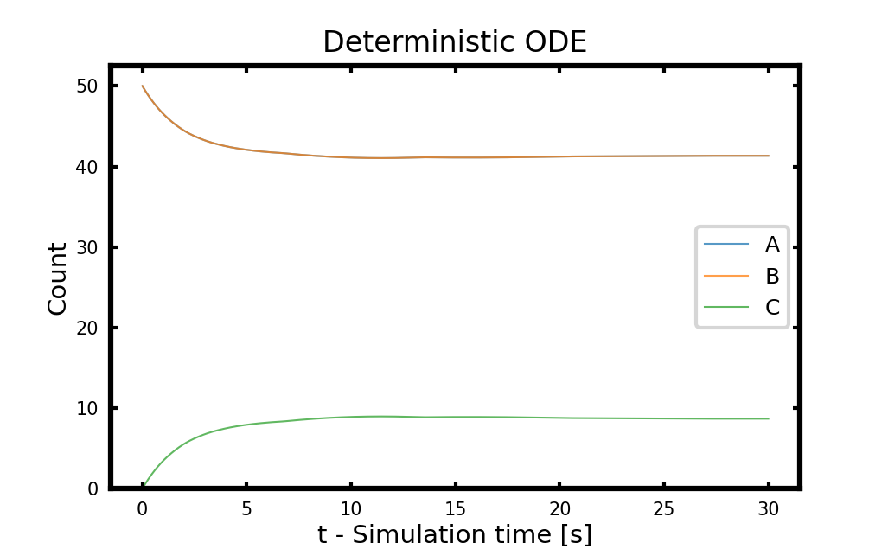
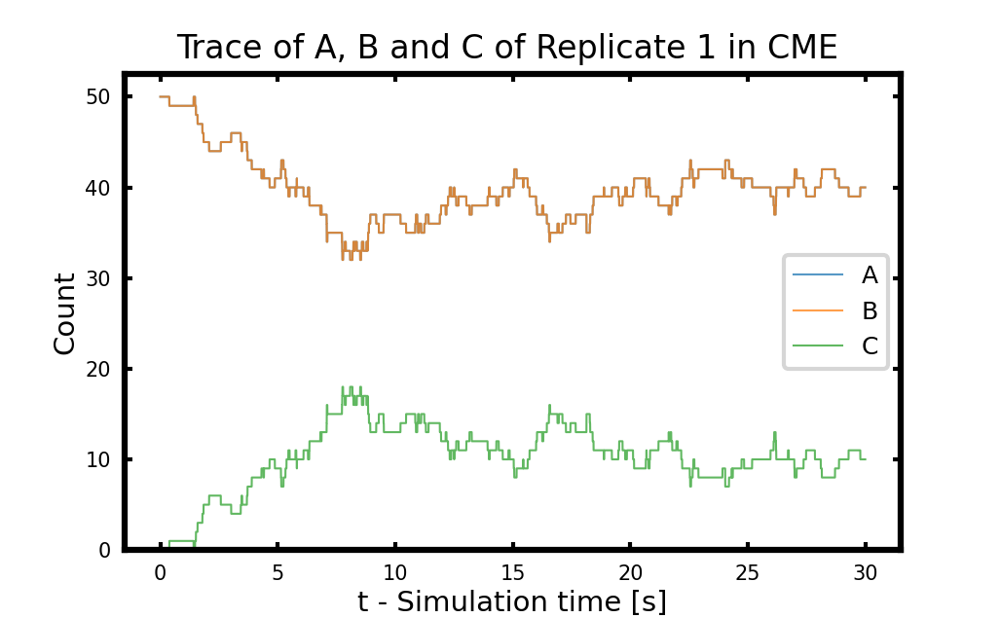
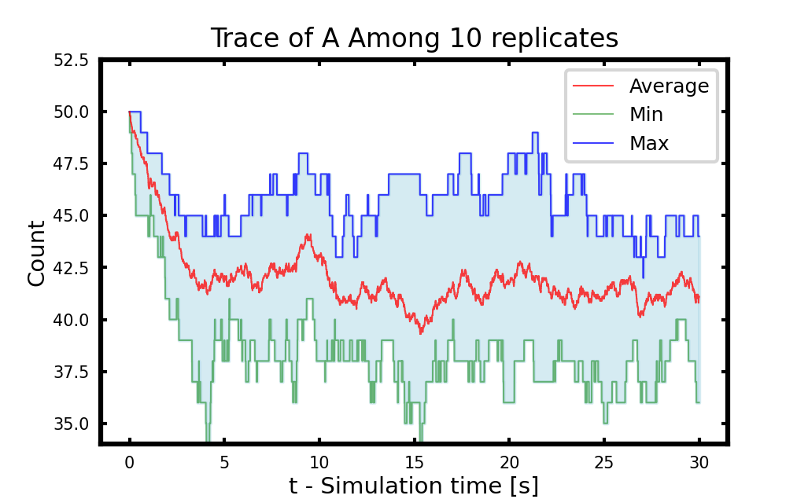
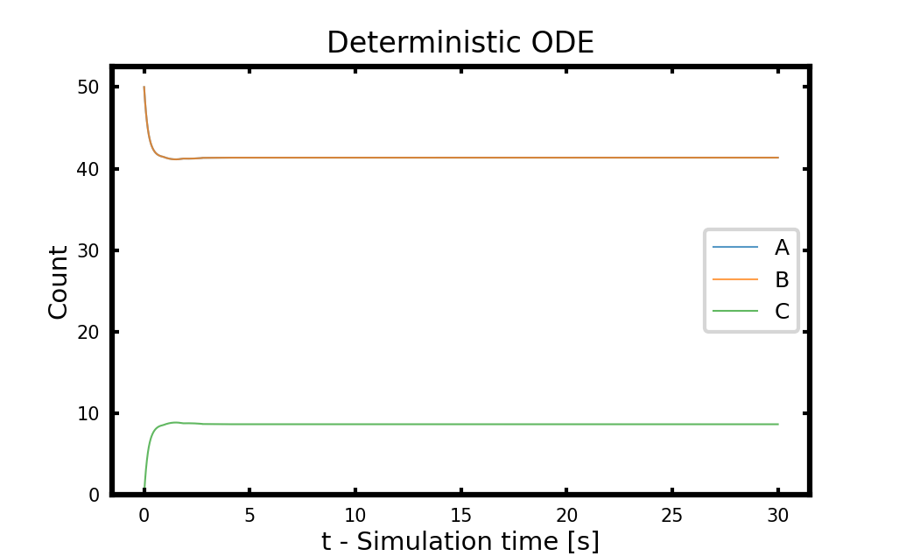
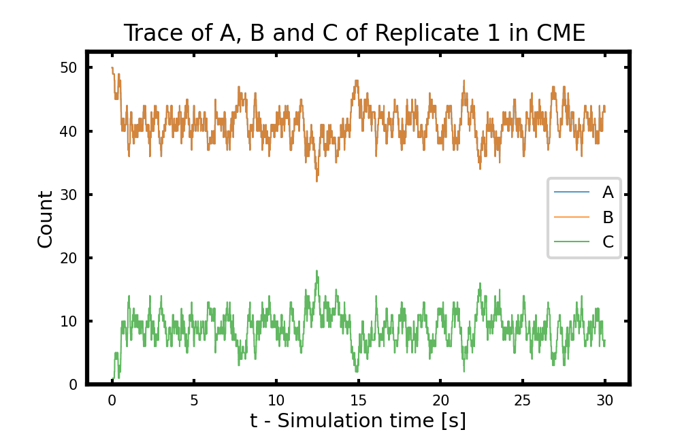

# Bimolecular Reaction Solved Stochastically by CME

## Biomolecular Reaction

In the first tutorial, we will motivate stochastic modeling with a simple example of a bimolecular reaction. The counts of reactants are small enough that you will see the fluctuations and variance of the stochastic result compared to the deterministic one. You will use `Tut1.1-ODEBimol.ipynb` to run the ODE of Bimolecular reaction solved with Scipy and `Tut1.2-CMEBimol.ipynb` to run the CME of the Bimolecular reaction with jLM in Lattice Microbe.

We will simulate the association/dissociation reaction of hypothetical molecules:
```math
\ce{A + B <=>[\ce{k_f}][\ce{k_r}]C}
```

Let us start out with a low number of each particles: 100 of A and B and 0 of C.  Let us imagine simulating that problem in a microbe sized volume of 1 $fL$. Also, let us start off with forward rate $k_f=1.07\times 10^6M^{-1}s^{-1}$ and backward rate $k_r=0.351/s$.

Under ODE representation using concentrations of species, the change of concentrations for A, B, and C are:
```math
\begin{aligned}
\frac{d[A]}{dt}&=-k_f[A][B]+k_r[C]\\
\frac{d[B]}{dt}&=-k_f[A][B]+k_r[C]\\
\frac{d[C]}{dt}&=k_f[A][B]-k_r[C]
\end{aligned}
```

Since we are using counts rather than concentrations in CME,  the forward rate constant (2nd order) is divided by Avogadro's number and the volume of the cell which takes us to units of molecules per second.

## Run the Jupyter Notebook

Now go to files on your Jupyter Notebook webpage `Tut1.1-ODEBimol.ipynb` to run the ODE of Bimolecular reaction solved with Scipy and `Tut1.2-CMEBimol.ipynb` to run the CME with jLM in Lattice Microbe.

## Recap

### Set up simulation with jLM

As mentioned in the introduction part, pyLM Problem Solving Environment is intensively used to construct the CME system. To do so, we need to import `jLM` module. 

The line `sim=CME.CMESimulation()` creates an empty simulation object. The next lines define the chemical species; in pyLM species are named by python strings and must be registered with the simulation using the `defineSpecies` command. `addReaction` function adds reactions to the defined species. 

In Lattice Microbes, you need to specify both the forward and back reactions separately.  The first and second argument can be either a tuple of reactants or a string when only one reactant is specified.  Lattice Microbes currently supports 0th, 1st and 2nd order reactions, and reaction rates must be specified in the stochastic format. In the special case of a 0th order reaction, the empty string `""` should be passed as the reactant.  In addition, annihilation reactions can be specified by passing the empty string `""` as the product parameter.

The following lines with `addParticles` define the initial species counts.

Next the simulation parameters are specified, time steps will be written out every 30 microseconds and the total simulation will run for 30 seconds.  The next line is of particular importance; the simulation must be saved to a file before running the simulation.  

Finally, we call the `run(...)` command on the simulation object giving it the name of the simulation file, the simulation method and the number of independent trajectories (replicates) to run of that simulation. In this tutorial, we use Direct Gillespie Algorithm to sample stochastic bimolecular reaction system.

By running the simulation, you will see a long standard output showing the number of finished replicates. Generally, CME simulation will finish rather quickly.

`pySTDLM` is a library of standard functionality such as standard reaction systems, cell systems.  In addition it contains a number of pre- and post-processing functionality. In the post processing part, we showed two build-in functions in `pySTDLM:PostProcessing.plotTrace` for a single replicate and `PostProcessing.plotAvgVarFromFile` for the whole ensemble to visualize the results.

In the jupyter notebook, we also introduce a more general way to do the analysis where we first serialize the output LM file into a 3D numpy array and plot using custom functions. You will use this method in Tutorial 2 and 3 when doing analysis.

### Compare CME with ODE result

In ODE result, what you should note is that the count of each species varies smoothly across the time course. However, the count of each reactant must be in integer numbers due to the discreteness of molecules. Further, the reactions occur via the collision between two molecules, so the change of count also in integer units. Under such reasoning, the ODE result is not accurate anymore for microscopic reactions where the counts of reactants are low. Stochastic modeling was designed to address this point.  

<p align="center">
    <br>
  <b>Figure 1. Comparison between ODE trajectory and CME trajectory of replicate 1</b>
</p>

You might note that the behavior in stochastic result is qualitatively the same to the deterministic ODE result, however there appears to be considerable fluctuation, even after the system has come to equilibrium.  This is due to the stochastic nature of the process, where the reaction can transiently fluctuate away from the equilibrium value.  In addition, you may be able to tell that the changes in particle number from one time to another are in integer increments, though this will become considerably more obvious at lower number of particles.


## Discussion

### 1. Increase the sample size 

Change the replicates number from 10 to 100 or even more in Tutorial 1.2. You need to change the variable `reps` and restart the Jupyter Notebook kernel to start a new CME simulation. See **Figure 2** for the situation with 10 and 100 replicates. Does the higher replicates number lead to a smoother average and variance?

<p align="center">
    <br>
  <b>Figure 2. Population average of particle A in 10 (Left) and 100 (Right) replicates solved stochastically.</b>
</p>

### 2. Increase the reaction rate

Multiple both the forward and backward rate constants by 10 or even 100 by changing variable `fold`, and restart and run ODE and CME Jupyter Notebooks again. In ODE, does the system converge to equilibrium faster? Does the equilibrium count change? In CME, does the fluctuation in single replicate become faster? How about the ensemble average? See **Figure 3**.

<p align="center">
    <br>
  <b>Figure 3. ODE trajectory and CME trajectory of replicate 1 with 10 times faster forward and backward rates.</b>
</p>

