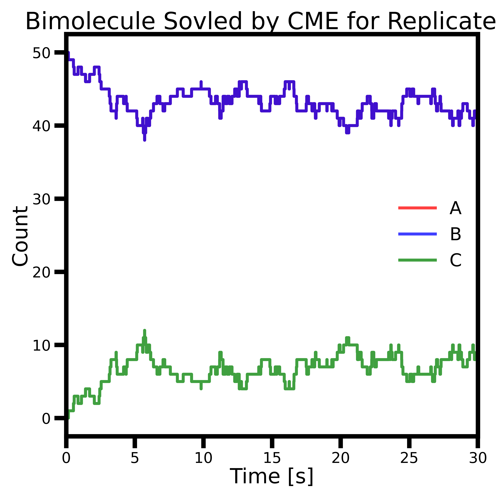
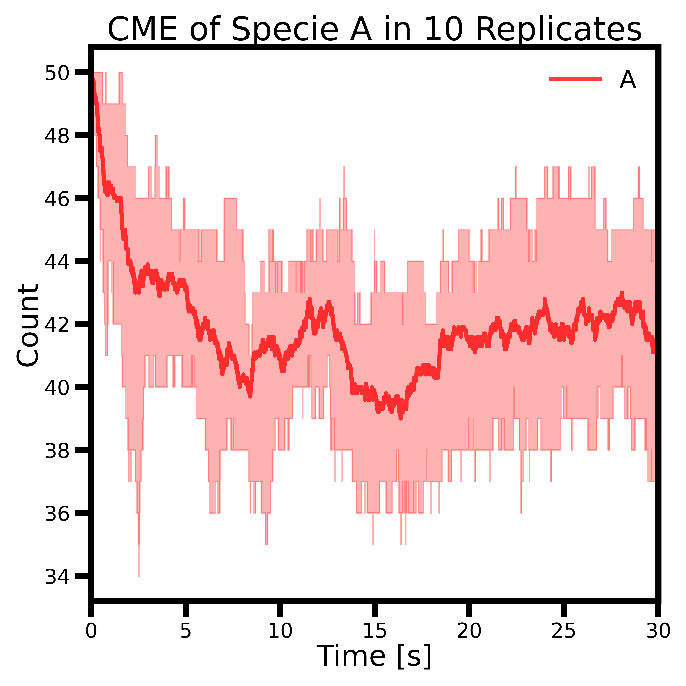
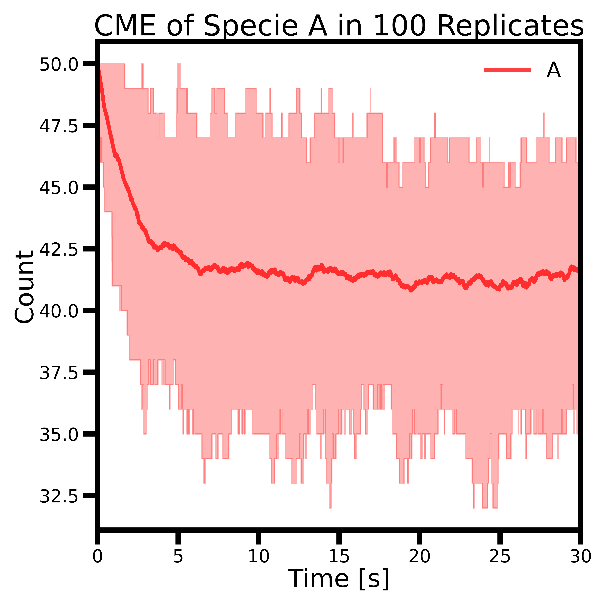
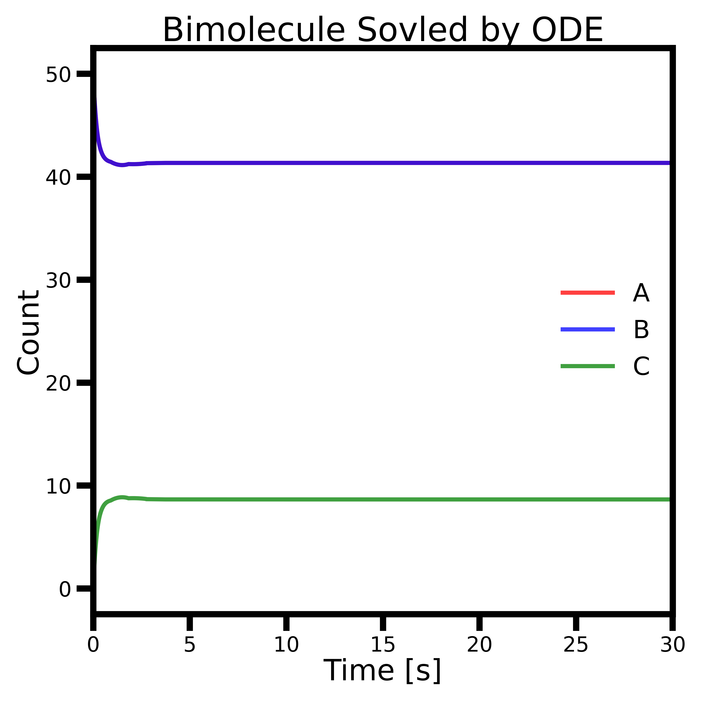
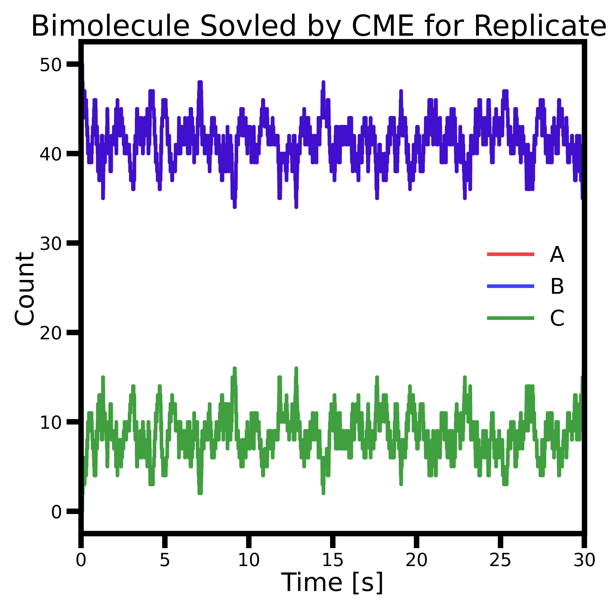

# Bimolecular Reaction Solved Stochastically by CME

## Biomolecular Reaction

In this tutorial, we will introduce stochastic modeling using a simple bimolecular reaction. The numbers of reactant molecules are small enough that you will observe fluctuations and variance in the stochastic results compared to the deterministic ones.

We will model the reversible association/dissociation reaction of hypothetical molecules:
```math
\ce{A + B <=>[\ce{k_f}][\ce{k_r}]C}
```

We begin with small initial counts: 100 molecules of A, 100 of B, and 0 of C. These molecules are placed in a microbe-sized volume of 1 fL. Also, let us start off with forward rate $k_f$=1.07 $\times10^6$ M<sup>-1</sup>s<sup>-1</sup> and backward rate $k_r$=0.351 s<sup>-1</sup>.

Under ODE representation using concentrations of species, the rates of change of A, B, and C are:

```math
\begin{aligned}
\frac{d[A]}{dt}&=-k_f[A][B]+k_r[C]\\
\frac{d[B]}{dt}&=-k_f[A][B]+k_r[C]\\
\frac{d[C]}{dt}&=k_f[A][B]-k_r[C]
\end{aligned}
```

In contrast, when using the CME, we work with discrete molecular counts instead of concentrations. To make the forward rate constant compatible with molecule-based stochastic simulation, we convert it by dividing by Avogadro’s number and the system volume, yielding units of reactions per molecule per second.

## Run the Jupyter Notebook

Now go to Jupyter Notebook interface and navigate to directory `/CME/bimolecule/`. You will use the notebook `Tut1.1-ODEBimol.ipynb` to simulate the bimolecular reaction using ordinary differential equations (ODEs) solved with SciPy, and `Tut1.2-CMEBimol.ipynb` to simulate the same reaction using the Chemical Master Equation (CME) with jLM in Lattice Microbes.

To run a Jupyter Notebook, you can use short-cut **Control+Enter** to execute the selected cell. Or, you can click **Cell-Run All** to run the entire script.

## Recap

### Set Up Simulation and Analyze with jLM

As introduced earlier, the jLM Problem Solving Environment is now widely used to construct CME systems. To get started, we first import the necessary `jLM` modules.

The line `sim = CME.CMESimulation()` creates an empty simulation object. The next lines define the chemical species. In `jLM.CME`, species are represented by Python strings and must be registered with the simulation using the `defineSpecies` command. Reactions are then added using the `addReaction` function.

In Lattice Microbes, both the forward and reverse reactions must be specified separately. The first and second arguments of `addReaction` can be either a tuple of reactants or a single string if only one reactant is involved. `jLM.CME` currently supports 0th-, 1st-, and 2nd-order reactions, and reaction rate constants must be given in stochastic units. For 0th-order reactions, use the empty string `""` as the reactant. Similarly, annihilation reactions can be specified by passing `""` as the product.

The following lines with `addParticles` define the initial counts of each species accumulatively.

Next, simulation parameters are specified. In this tutorial, we write simulation output every 30 microseconds and run the simulation for a total of 30 seconds. An important detail: the simulation must be saved to a file before it can be executed.

Finally, we call the `run(...)` command on the simulation object, specifying the filename, the simulation method, and the number of independent trajectories (replicates) to run. In this tutorial, we use the **Direct Gillespie Algorithm** to sample the stochastic dynamics of the bimolecular reaction system.

When the simulation runs, you will see a standard output listing the number of completed replicates. In general, CME simulations finish relatively quickly.

We use the built-in module `jLM.CMEPostProcessing` for basic post-processing tasks. These include plotting time-dependent trajectories for individual replicates, and calculating population averages and variances across replicates.

Additionally, the Jupyter notebook demonstrates a more flexible analysis approach: the simulation output is first serialized into a 3D NumPy array (with dimensions of species, time, and replicates) and then visualized using custom plotting functions. You will apply this method in Tutorials 2 and 3 for more advanced analysis.

### Compare CME with ODE Results

In the ODE results, you'll notice that the counts of each species change smoothly over time. However, in reality, molecule counts must be integers due to the discrete nature of matter. Since reactions occur through collisions between individual molecules, the changes in molecular counts also happen in integer steps. For systems with low molecule counts, this discreteness becomes significant, and ODEs no longer provide accurate descriptions. Stochastic modeling was developed to capture this behavior.

<p align="center">
   
   <br>
  <b>Figure 1. Comparison between ODE trajectory and one CME replicate</b>
</p>

You may notice that the behavior in the stochastic (CME) results is qualitatively similar to the deterministic ODE results. However, the CME trajectories exhibit considerable fluctuations, even after the system reaches equilibrium. These fluctuations arise from the intrinsic randomness of the process, where reactions can transiently deviate from the equilibrium state.

Additionally, you might observe that the particle counts change in discrete steps between time points—this feature becomes even more apparent when molecule counts are lower.

## Discussion

### 1. Increase the Sample Size

In Tutorial 1.2, try increasing the number of replicates from 10 to 100—or even more. To do this, change the variable `reps` and restart the Jupyter Notebook kernel by clicking **Kernel-Restart & Clear Output** to begin a new CME simulation. 

See **Figure 2** for a comparison of the results using 10 and 100 replicates. Does increasing the number of replicates lead to smoother population averages and reduced variance?

<p align="center">
   
   <br>
  <b>Figure 2. Population average of species A across 10 (left) and 100 (right) stochastic replicates.</b>
</p>

### 2. Increase the Reaction Rate

Multiply both the forward and backward rate constants by 10 or 100 by modifying the variable `fold`. Then, restart and rerun both the ODE and CME Jupyter Notebooks.

- In the ODE simulation, does the system reach equilibrium more quickly? Does the equilibrium concentration change?
- In the CME simulation, do the fluctuations in a single replicate occur more rapidly? How does the ensemble average respond?

See **Figure 3** for a comparison.

<p align="center">
   
   <br>
  <b>Figure 3. ODE trajectory and a single CME replicate with 10× faster forward and backward rates.</b>
</p>
