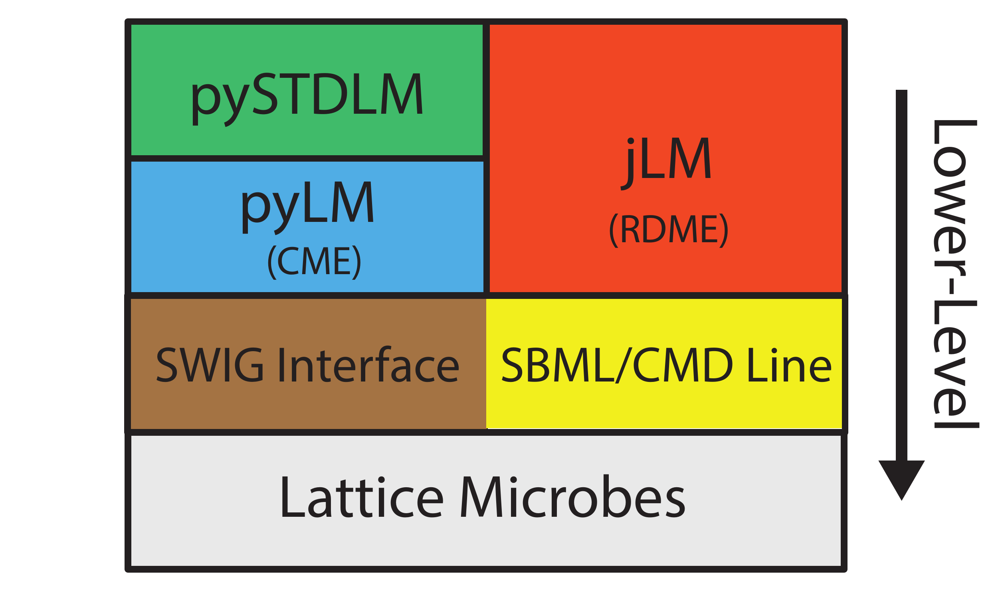
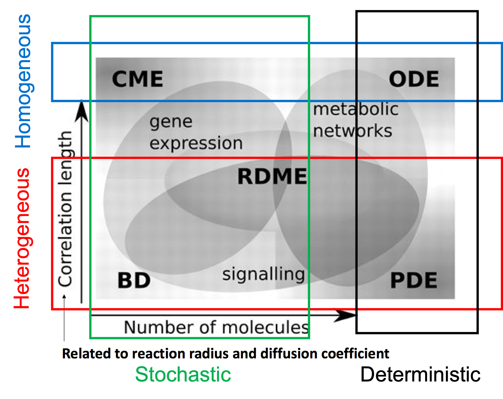
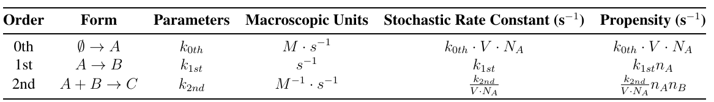

# Introduction

## Overview of Lattic Microbe and jLM

Lattice microbe (LM) is a graphics processing units (GPUs) accelerated stochastic simulation platform. The latest published version can be found at [Lattice Microbe on Luthey-Schulten Lab GitHub](https://github.com/Luthey-Schulten-Lab/Lattice\_Microbes).

LM is designed to simulate stochastic processes in biological cells using the spatially homogenoues Chemical Master Equation (CME) and heterogenours Reaction Diffusion Master Equation (RDME). With hooking, one can also incorporate metabolic reactions simulated with Ordinary Differential Equation (ODE) and chromosome dynamics with Brownian Dynamics (BD).

jLM is the python-based Problem Solving Environments (PSE) designed to integrate with Jupyter Notebook, and was developed in 2018, after pyLM in 2013 (*Outdated Now*). jLM sits on top of a SWIG interface that allows the C++ code to be accessible from the Python terminal. Using jLM allows the user to set up, run and post-process simulations all within a single script, and the calculation is still performed in C++. The API of jLM can be found at [Lattice Microbes API Reference](https://forxhunter.github.io/LM2.5_doc/API.html).

<!--  -->

<p align="center">
   <br>
  <b>Figure 1. Schematic diagram of the LM architecture</b>
</p>

A general workflow of jLM in LM is shown as follows. jLM is compatible for both CME and RDME simulations. Designed with Jupyter Notebook interfaces, jLM offers a suite of functions to visualize the RDME simulation states like spatial regions, species and reactions when setting up the system. In the `hookSimulation()`, various algorithms can be incorporated with CME and RDME to fullfile the hybrid algorithms.

<p align="center">
   <br>
  <b>Figure 2. Workflow of jLM</b>
</p>

## Stochastic Modeling of Cellular Processes

CME and RDME are the homogenous and heterogenous stochastic chemical reaction kinetics algorithms. Ordinary Differential Equations (ODE) is suitable for macroscopic and homogenous chemical kinetics that includes metabolic networks in the minimal cell. Brownian Dynamics (BD) is used in continuum polymer chromosome model.

<p align="center">
   <br>
  <b>Figure 3. Stochastic/Deterministic and Homogenous/Heteregenours Simulation Algorithms</b>
</p>

### Chemical Master Equation (CME)

In CME, the state of the system $\mathbf{x}$ as a vector is the counts of all species. The transition between different states is the fire of single chemical reaction $r$ out of all reactions $R$ with stoichiometry $\mathbf{S_r}$. The probability for the fire of each single chemical reaction in next time step $dt$ is $a_r({{\mathbf{x}}})dt$, where we name $a_r({{\mathbf{x}}})$ propensity of reaction $r$ under system state $\mathbf{x}$. Propensities are calculated shown in in **Table 1** where macroscopic ODE rate constants are first converted into stochastic ones and then calculate the propensity using mass action law. $V$ is the volume of the system, $N_A$ the Avogadro’s number, $n_A$ and $n_B$ is the absolute count of particle A and B.

```math
\frac{dP(\mathbf{x},t)}{dt}=\sum_{r}^{R} [-a_r({{\mathbf{x}}}) P({{\mathbf{x}}},t) + a_r({{\mathbf{x}}}_\nu-\mathbf{S_r}) P({{\mathbf{x}}}-\mathbf{S_r},t)]
```

<p align="center">
  <b> Table 1. Zeroth, First and Second Order reactions in ODE and CME. </b> <br>
  
  
</p>


<!-- <p align="center">
  <b>Table 1. Zeroth, First and Second Order reactions in ODE and CME. Here, the stochastic rate constant should be computed from the macroscopic rate constant using the volume of the experiment, V , and Avogadro’s number, NA .</b> <br>
   <br>
</p> -->

Thus, Chemical Master Equation states that the derivative of probability, $P(\mathbf{x},t)$ to stay in state $\mathbf{x}$ with respect to time $t$ equals the summation of in-flow, $`\sum_{r}^{R}[a_r({{\mathbf{x}}}_\nu-\mathbf{S_r}) P({{\mathbf{x}}}-\mathbf{S_r},t)]`$ minus the out-flow, $`\sum_{r}^{R} [-a_r({{\mathbf{x}}}) P({{\mathbf{x}}},t)]`$.

Similarly to ODE, CME for complex system is unsolvable. In most cases, we use Gillespie Algorithm (also known as Stochastic Simulation Algorithm or SSA) to sample multiple trajectories which represent the stochastic evolution of the system. We will not dive into Gillespie Algorithm in this tutorial but you are free to look more at [Wiki Gillespie](https://en.wikipedia.org/wiki/Gillespie\_algorithm}) and [Stochastic Simulation of Chemical Kinetics](https://labs.engineering.asu.edu/acs/wp-content/uploads/sites/33/2016/08/GillespieOverview2007.pdf) from Daniel T. Gillespie.

### Reaction Diffusion Master Equation (RDME)

RDME is used to simulate spatially heterogenous systems by discretizing the entire volume into cubic lattice. Within each lattice site, the reactions are assumed to be well-stirred and described by separated CMEs as shown in the first summation. The second summation describes the flow of probability due to the diffusion between neighboring lattice sites.

```math
\begin{aligned}
\frac{dP(\mathbf{x},t)}{dt} & = \sum_{\nu}^{V}\sum_{r}^{R} [-a_r({{\mathbf{x}}}_\nu) P({{\mathbf{x}}}_\nu,t) + a_r({{\mathbf{x}}}_\nu-\mathbf{S_r}) P({{\mathbf{x}}}_\nu-\mathbf{S_r},t)] \\
& + \sum_{\nu}^{V}\sum_{\xi}^{\pm\hat{i},\hat{j},\hat{k}}\sum_{\alpha}^{N} [-d_{xi}^{\alpha} x_{\nu}^{\alpha} P({{\mathbf{x}}},t) + d_{\xi}^{\alpha} (x_{\nu+\xi}^{\alpha}+1_{\nu}^{\alpha}) P({{\mathbf{x}}}+1_{\nu+\xi}^{\alpha}-1_{\nu}^{\alpha},t)]
\end{aligned}
```
