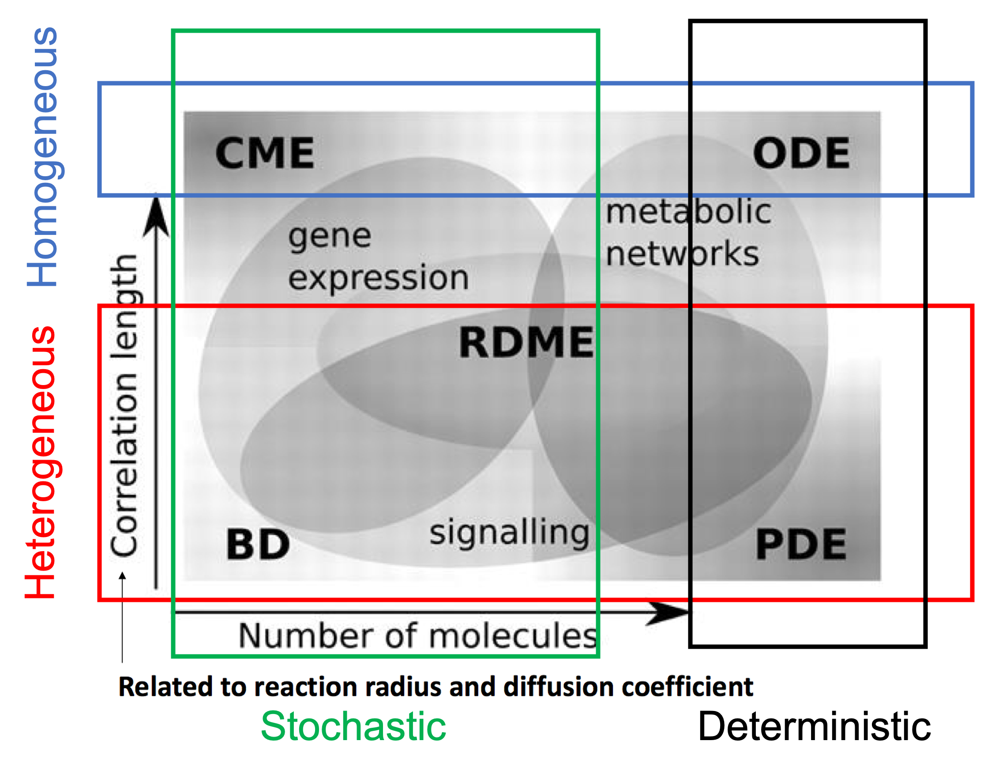

# Introduction to Lattice Microbes and Stochastic Modelling

## Overview of Lattic Microbes and jLM

Lattice Microbes (LM) is a GPU-accelerated stochastic simulation platform. The latest published version can be found at [Lattice Microbes on Luthey-Schulten Lab GitHub](https://github.com/Luthey-Schulten-Lab/Lattice_Microbes).

LM is designed to simulate stochastic processes in biological cells using the spatially homogeneous Chemical Master Equation (CME) and heterogeneous Reaction Diffusion Master Equation (RDME). With "hooking", one can also incorporate custom events, including metabolic reactions simulated with Ordinary Differential Equation (ODE), and chromosome dynamics with Brownian Dynamics (BD).

jLM is a Python-based Problem Solving Environment (PSE) designed to integrate with Jupyter Notebooks. It was developed in 2018 as a successor to pyLM (from 2013, *now outdated*). jLM sits on top of a SWIG interface that allows the C++ backend to be accessed from the Python terminal. Using jLM allows users to set up, run, and post-process simulations within a single script, while the calculations are still executed in C++. The jLM application programming interface (API) can be found at [Lattice Microbes API Reference](https://forxhunter.github.io/LM2.5_doc/API.html).

<!--  -->

<p align="center">
   <br>
  <b>Figure 1. Schematic diagram of the LM architecture</b>
</p>

A general workflow of jLM within LM is shown below. jLM supports both CME and RDME simulations. Designed to work with Jupyter Notebooks, jLM offers a suite of functions to visualize RDME simulation elements such as spatial regions, species, and reactions during setup. In `hookSimulation()`, various algorithms can be incorporated into CME or RDME simulations to implement hybrid algorithms.

<p align="center">
   <br>
  <b>Figure 2. Workflow of jLM</b>
</p>

## Stochastic Modeling of Cellular Processes

**The discreteness and stochasticity of chemical kinetics play a role when the number of reactants is significantly low**. For the species in genetic information processes, most mRNAs have a number of 1 or 2, which is significantly smaller than ATP of counts $10^6$. Based on the initial volume of JCVI-syn3A (200 nm radius, 0.035 fL, 1 particle count equals 50 nM), mRNA concentrations are 50 or 100 nM, and ATP is roughly 5 mM. Therefore, it is necessary to simulate the kinetics in genetic information processes (GIP) and protein complex assembly with stochastic CME or RDME and metabolism with deterministic ODE.

CME and RDME are algorithms for simulating homogeneous and heterogeneous stochastic chemical reaction kinetics, respectively. Ordinary Differential Equation (ODE) is suitable for macroscopic and homogeneous systems, such as metabolic networks in minimal cells. Brownian Dynamics (BD) is used for modeling the dynamics of chromosome polymers in a continuum.

<p align="center">
   <br>
  <b>Figure 3. Stochastic/Deterministic and Homogenous/Heterogeneous Simulation Algorithms</b>
</p>

### Chemical Master Equation (CME)

In CME, the system state $\mathbf{x}$ is a vector representing the count of all species. The transition between states occurs via the firing of a single chemical reaction $r$ with stoichiometry $\mathbf{S_r}$, out of all reactions $R$. The probability that reaction $r$ fires in the next time step $dt$ is $a_r(\mathbf{x})dt$, where $a_r(\mathbf{x})$ is the so-called *propensity* of reaction $r$ under the system state $\mathbf{x}$. 

Propensities are calculated as shown in **Table 1**, where macroscopic ODE rate constants are first converted into stochastic rate constants, and then used to calculate the propensity via the law of mass action. Here, $V$ is the system volume, $N_A$ is Avogadro’s number, and $n_A$, $n_B$ are the absolute counts of particles A and B.

<!-- In CME, the state of the system $\mathbf{x}$ as a vector is the counts of all species. The transition between different states is the fire of a single chemical reaction $r$ out of all reactions $R$ with stoichiometry $\mathbf{S_r}$. The probability for the fire of each single chemical reaction in next time step $dt$ is $a_r({{\mathbf{x}}})dt$, where we name $a_r({{\mathbf{x}}})$ propensity of reaction $r$ under system state $\mathbf{x}$. Propensities are calculated shown in in **Table 1** where macroscopic ODE rate constants are first converted into stochastic ones and then calculate the propensity using mass action law. $V$ is the volume of the system, $N_A$ the Avogadro’s number, $n_A$ and $n_B$ is the absolute count of particle A and B. -->

```math
\frac{dP(\mathbf{x},t)}{dt}=\sum_{r}^{R} [-a_r({{\mathbf{x}}}) P({{\mathbf{x}}},t) + a_r({{\mathbf{x}}}_\nu-\mathbf{S_r}) P({{\mathbf{x}}}-\mathbf{S_r},t)]
```

<p align="center">
  <b> Table 1. Zeroth, First and Second Order reactions in ODE and CME. </b> <br>
  
  
</p>

Thus, the Chemical Master Equation states that the derivative of the probability $P(\mathbf{x},t)$ of being in state $\mathbf{x}$ with respect to time $t$ is the sum of all probability inflows (transitions into $\mathbf{x}$) minus the outflows (transitions out of $\mathbf{x}$):

- Inflow: $\sum_{r}^{R} a_r(\mathbf{x}-\mathbf{S_r}) P(\mathbf{x}-\mathbf{S_r},t)$

- Outflow: $\sum_{r}^{R} a_r(\mathbf{x}) P(\mathbf{x},t)$

<!-- Thus, Chemical Master Equation states that the derivative of probability, $P(\mathbf{x},t)$ to stay in state $\mathbf{x}$ with respect to time $t$ equals the summation of in-flow, $`\sum_{r}^{R}[a_r({{\mathbf{x}}}_\nu-\mathbf{S_r}) P({{\mathbf{x}}}-\mathbf{S_r},t)]`$ minus the out-flow, $`\sum_{r}^{R} [-a_r({{\mathbf{x}}}) P({{\mathbf{x}}},t)]`$. -->

As with ODEs, CMEs for complex systems are generally not analytically solvable. Therefore, the Gillespie Algorithm—also known as the Stochastic Simulation Algorithm (SSA)—is commonly used to sample many trajectories that capture the system’s stochastic evolution. Unlike numerical algorithms for ODEs, such as the well-known *LSODA*, the Gillespie Algorithm determines both the time until the next reaction and which reaction occurs by sampling **from random numbers**. You are encouraged to refer to [Wiki Gillespie](https://en.wikipedia.org/wiki/Gillespie\_algorithm}) and [Stochastic Simulation of Chemical Kinetics](https://labs.engineering.asu.edu/acs/wp-content/uploads/sites/33/2016/08/GillespieOverview2007.pdf) by Daniel T. Gillespie to know more details.

### Reaction Diffusion Master Equation (RDME)

The RDME is used to simulate spatially heterogeneous systems by dividing the volume into subvolumes, usually a 3D cubic lattice. Within each lattice site, reactions are assumed to be well-stirred and are governed by individual CMEs (first summation below). The second summation accounts for diffusion by describing the flow of probability between neighboring lattice sites.

```math
\begin{aligned}
\frac{dP(\mathbf{x},t)}{dt} & = \sum_{\nu}^{V}\sum_{r}^{R} [-a_r({{\mathbf{x}}}_\nu) P({{\mathbf{x}}}_\nu,t) + a_r({{\mathbf{x}}}_\nu-\mathbf{S_r}) P({{\mathbf{x}}}_\nu-\mathbf{S_r},t)] \\
& + \sum_{\nu}^{V}\sum_{\xi}^{\pm\hat{i},\hat{j},\hat{k}}\sum_{\alpha}^{N} [-d_{xi}^{\alpha} x_{\nu}^{\alpha} P({{\mathbf{x}}},t) + d_{\xi}^{\alpha} (x_{\nu+\xi}^{\alpha}+1_{\nu}^{\alpha}) P({{\mathbf{x}}}+1_{\nu+\xi}^{\alpha}-1_{\nu}^{\alpha},t)]
\end{aligned}
```
