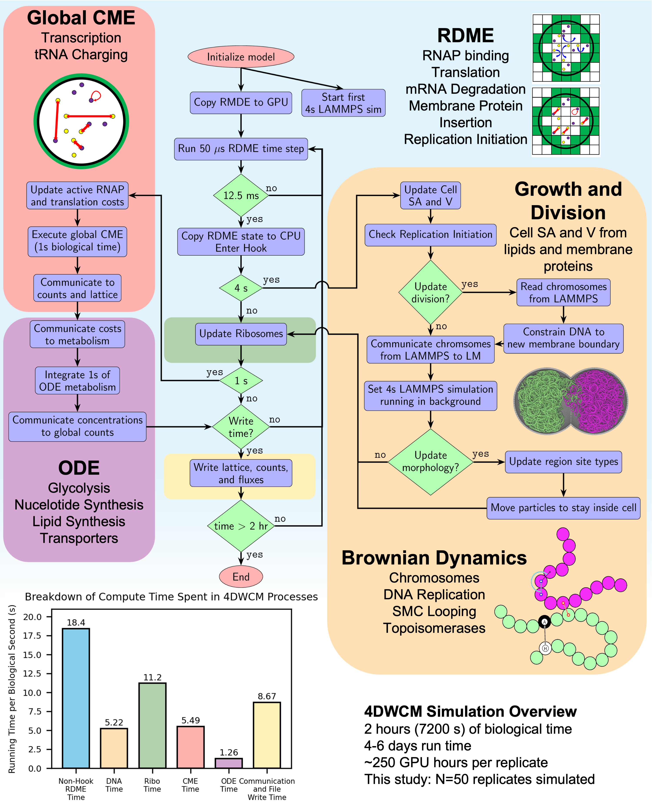

# Summer-School Tutorial on the 4D Whole-Cell Model (4DWCM) of *JCVI-syn3A*

## 0. Data downloads

Since time cost of running the whole cell model is very high, we won't actually run the RDME hybrid 4DWCM live. Instead, I will briefly introduce the logic of the 4DWCM and try to analyze 50 trjectories as average stored in zenodo. 
 
## 1  Model Overview and the Hybrid Simulation Flowchart

The 4DWCM [1] integrates four numerical engines so that every molecular event of a living minimal cell can be followed for its entire 105-min division cycle. A reaction-diffusion master-equation (RDME) solver on the GPU advances Brownian motion and local reactions in 10 nm lattice voxels with 50 µs steps. Every 12.5 ms of biological time the RDME is paused and three auxiliary solvers are called: 
1. a global chemical-master-equation module for low-copy, well-stirred reactions such as transcription initiation and tRNA charging 

2. an ordinary-differential-equation solver for the 493-reaction metabolic network

3. a Brownian-dynamics simulation running on a second GPU that evolves the coarse-grained chromosome, replication forks and SMC-loop extrusion. 

### 1.1 initiation

* The simulation begins by **initializing the model**.
* **RDME state is copied to the GPU**, and the first **4-second LAMMPS simulation** is launched (LAMMPS handles particle-level dynamics for DNA and its interaction with cell membrane).

### 1.2. Core Hybrid Loop (Iterates over 2 hours(120 min) of biological time)

#### ⏱ Hook Timings:

* Every **RDME** timestep is 50 $\mu s$
* After every **12.5 ms**, the RDME state is:

  * **Copied back to the CPU**, and
  * **Hook routines are executed** to determine whether further biological updates are needed.

* If **4 seconds** of simulation time have passed:

  * **Update Ribosomes** (to check translation states).
* If **1 second** of biological time has passed:

  * **Update Global CME** (for transcription and tRNA charging).

    * Update RNAP/translation costs.
    * Execute **global CME for 1 s** of biological time.
    * Communicate molecule usage back to **ODE metabolism module**.
  * Run **ODE metabolism** (glycolysis, nucleotide/lipid synthesis).
  * **Communicate new concentrations** back to global counts.

### 1.4. Spatial Cell Modeling with Brownian Dynamics

* When **growth or division** is triggered:

  * **Cell surface area and volume (SA/V)** are updated from lipid/protein data.
  * If a new division event occurs:

    * Read **chromosomes from LAMMPS**.
    * **Constrain DNA to daughter cell boundaries**.
    * Update the **morphology** of the cell (region site types).
    * **Move particles to stay inside** the membrane.
  * **New 4-second LAMMPS simulation** is triggered in the background.

### 1.5. Output and Termination

* Every second, the workflow checks whether **data should be written**.
* If simulation time exceeds **2 biological hours**, the run ends.
* If not, it loops back to the next 50 µs RDME step.

### 2. functional process handling 

| Module                | Processes Handled                                     |
| --------------------- | ----------------------------------------------------- |
| **Global CME**        | Transcription, tRNA charging, cost propagation        |
| **ODE**               | Metabolism, nucleotide & lipid synthesis              |
| **RDME**              | Translation, protein insertion, mRNA degradation      |
| **Brownian Dynamics/LAMMPS** | DNA replication, chromosome movement, topoisomerases  |
| **Free-DTS**            | Cell morphology |

#### 2  Geometry: Surface Area, Volume and DNA Doubling

The simulated cell begins as a sphere of radius 200 nm and grows isotropically until its volume doubles (\~68 min), after which an invagination appears and constriction proceeds until cytokinesis at \~106 min. Membrane synthesis continues throughout, so surface area does not plateau until division is complete. DNA replication initiates after a short B-period of \~5 min, finishes at \~51 min, and the combined timing of DNA and membrane growth predicts an ori\:ter ratio of 1.28, remarkably close to the experimental value of 1.21 . The staggered vertical lines in the figure below mark, respectively, the mean times at which DNA, volume and surface area have doubled in the 50-cell ensemble.

## 3  Complex assembly and active counts

By the time the average cell reaches the division point (\~105 min) it contains 881 ribosomes, 176 RNA polymerases and 192 degradosomes. Because the subunits of RNAP and the degradosome are placed unassembled at t = 0, these complexes self-assemble within the first biological second and then track gene expression demand throughout the cycle. Roughly 55 % of ribosomes are translating, 70 % of RNAP are elongating, and 10 % of degradosomes are actively degrading at any instant, values that fall within the broad ranges measured for bacteria with richer proteomes .

## 4  Protein and mRNA Accumulation relative to Replication Initiation

Replication typically starts five minutes after birth but can be delayed to as late as 46 min in outlier cells . Because DNA, volume and metabolism are still ramping up during this brief interval, protein totals at initiation exceed the inoculum by barely ten per cent, whereas mRNA pools have already expanded two-fold owing to their shorter lifetimes and the burst of RNAP assembly. When the same cells are inspected at 105 min, the distribution of the “scaled protein count” (protein copies at 105 min divided by the initial copy number) peaks just below two, revealing that the model falls slightly short of perfect protein doubling for the average gene, especially for long, slow-translated proteins . The corresponding mRNA distribution is broader—owing to stochastic transcription–degradation—but its median also lies beneath 2, confirming that underproduction of transcripts is a principal cause of the modest protein shortfall.

## 5  Whole-Cell Energetics: ATP Production and Expenditure

Figure S4 parses every ATP-consuming reaction each second of the cycle . Averaged over the population, the biosynthetic and maintenance costs of translation, transcription, transport, lipid insertion and other processes nearly match the ATP made by glycolysis and substrate-level phosphorylation; a narrow surplus keeps the nucleotide triphosphate pool from depletion. Because DNA synthesis draws ATP only while forks are active, a transient shoulder appears in the fractional-cost curve during replication. The shoulder broadens into a 60–90 min plateau because the one cell that delayed initiation until 46 min remained in C-period after its peers had already finished. In single-cell traces (panel C of Figure S4) the ATP demand fluctuates sharply with bursts of gene expression and septal growth, whereas the population mean appears smooth, highlighting the role of stochastic expression in metabolic load balancing.

## references
[1] Thornburg, Z.R. et al. (2025) ‘Bringing the genetically minimal cell to life on a computer in 4D’, bioRxiv, p. 2025.06.10.658899. Available at: https://doi.org/10.1101/2025.06.10.658899.
