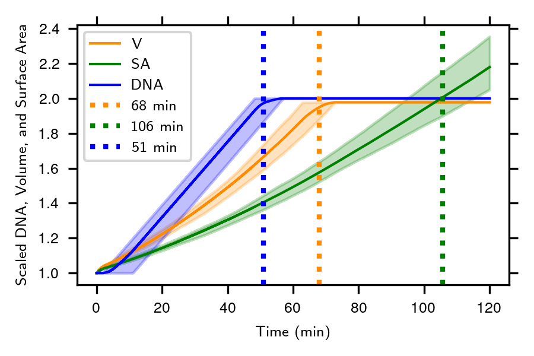
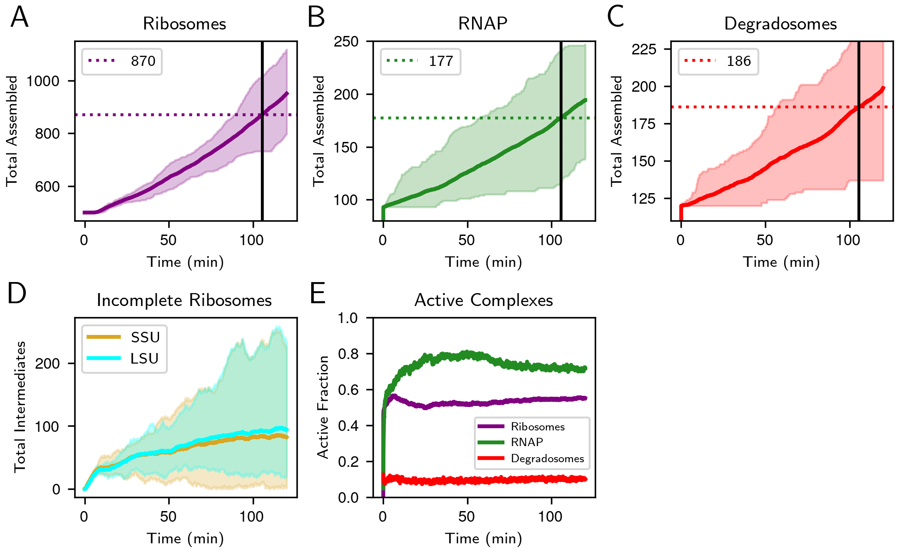

# 4D Whole-Cell Model (4DWCM) of *JCVI-syn3A*

## Description:


<div align="right">
  <br>
  <em>Source: Thornburg et al.,
  2025</em>
  </div>


In the ***4D Whole-Cell Model (4DWCM) of JCVI-syn3A*** tutorial, you will explore the trajectories of the most comprehensive computational model of a living minimal cell. The 4DWCM integrates four numerical algorithms(RDME-CME-ODE-BD) to simulate every molecular event during the entire 105-minute division cycle of the genetically minimal bacterium JCVI-syn3A. You will analyze and visualize spatially heterogeneous trajectories from pre-computed simulations, examining how reaction-diffusion master equations (RDME) on GPUs capture the spatial organization of cellular processes including protein synthesis, mRNA degradation, and complex assembly.

*This tutorial was prepared for the second edition of the STC QCB Summer School, held July 21-25, 2025.*

## Outline:

1. Set up the tutorial on Delta and data downloads
2. Model overview and hybrid simulation flowchart  
3. Geometry: surface area, volume and DNA doubling
4. Complex assembly and active counts
5. Proteomics relative to replication initiation
6. Whole-cell energetics: ATP production and expenditure

## 1. Set up the tutorial on Delta and data downloads

First, we need to get the data from this github repository:
>[!NOTE]
> Don't forget to login to Delta first!

```bash
git clone https://github.com/Luthey-Schulten-Lab/SummerSchool_2025.git

cd ./SummerSchool_2025/RDME/
```

Since the computational cost of running the whole cell model is very high, we won't actually run the RDME hybrid 4DWCM live. Instead, I will briefly introduce the logic of the 4DWCM and analyze 50 trajectories as averages stored in Zenodo.

First, we will download 50 trajectory files and 4 `lm` trajectories for later visualization. The original data are saved in [zenodo:15579159](https://zenodo.org/records/15579159), but I already downloaded them to delta. For quicker access, we will copy them from my folder to your folder.

```bash
bash copy.sh
```

If it works properly, you should find two directories created: `data` and `trajectory`.

---

Then we launch the server for **jupyter notebook** (This is the same process as CME part): 


- **First**: Submit a job to a Delta GPU node.  
    Here `srun` launches interactive job onto Delta, `partition` claims A100 GPU node, and for four hours `time`. A four digit number is randomly generated to specify the `port` for Jupyter Notebook. 

  ```bash
  srun --account=beyi-delta-gpu --partition=gpuA100x4 --time=04:00:00 --mem=64g --gpus-per-node=1 --tasks-per-node=1 --cpus-per-task=16 --nodes=1 apptainer exec --nv --containall --bind /projects/beyi/$USER/:/workspace /projects/beyi/$USER/CME/summer2025.sif bash -c "source /root/miniconda3/etc/profile.d/conda.sh && conda activate lm_2.5_dev && jupyter notebook /workspace/ --no-browser --port=$((RANDOM%9000+1000)) --ip=0.0.0.0 --allow-root"
  ```  

  Then you should wait for Delta to allocate the resources for your request, which usually takes less than 1 minute. When you see similar things as the following, you are good to proceed to the second step.

  ```bash
  srun: job 3546627 queued and waiting for resources
  srun: job 3546627 has been allocated resources
  WARNING: could not mount /etc/localtime: not a directory
  [I 19:07:57.203 NotebookApp] Writing notebook server cookie secret to /u/$USER/.local/share/jupyter/runtime/notebook_cookie_secret
  [I 19:07:58.314 NotebookApp] [jupyter_nbextensions_configurator] enabled 0.6.3
  [I 19:07:58.316 NotebookApp] Serving notebooks from local directory: /workspace
  [I 19:07:58.316 NotebookApp] Jupyter Notebook 6.4.12 is running at:
  [I 19:07:58.316 NotebookApp] http://`DeltaNode`.ncsa.illinois.edu:8811/?token=b2e7ca15cd9dc3a6893a1273e359c88869225bc29d66c80c
  [I 19:07:58.316 NotebookApp]  or http://127.0.0.1:$Port/?token=b2e7ca15cd9dc3a6893a1273e359c88869225bc29d66c80c
  [I 19:07:58.316 NotebookApp] Use Control-C to stop this server and shut down all kernels (twice to skip confirmation).
  [C 19:07:58.329 NotebookApp]

      To access the notebook, open this file in a browser:
          file:///u/$USERNAME/.local/share/jupyter/runtime/nbserver-13-open.html
      Or copy and paste one of these URLs:
          http://$DeltaNode.delta.ncsa.illinois.edu:$Port/?token=b2e7ca15cd9dc3a6893a1273e359c88869225bc29d66c80c
      or http://127.0.0.1:$Port/?token=b2e7ca15cd9dc3a6893a1273e359c88869225bc29d66c80c
  ```
>[!NOTE]
> The last two line contains the Delta GPU node `DeltaNode`, which is the node assgined by Delta to run your job. The `Port` is four digits randomly generated.

- **Second**: SSH into the Delta GPU node.  
  Open **another** terminal and run the following command after replacing.
>[!WARNING]
>***Replace*** `DeltaNode` with the node assgined by Delta.    
>***Replace*** `USERNAME` with your Delta username.   
>***Replace*** `Port` with the 4 digit number generated.

  ```bash
  ssh -l $USERNAME  -L 127.0.0.1:$Port:$DeltaNode.delta.internal.ncsa.edu:$Port dt-login.delta.ncsa.illinois.edu
  ```
  You need to type you password and do 2FA **AGAIN**.


- **Third**: Open Jupyter Notebook in a webpage.   
  Copy the last URL in the first terminal and paste to one browser (Firefox, Chrome, ...) to open Jupyter Notebook.
---


## 2. Model Overview and Hybrid Simulation Flowchart

The 4DWCM [1] integrates four numerical algorithms so that every molecular event of a living minimal cell can be followed for its entire 105-min division cycle:

1. A **reaction-diffusion master-equation (RDME) solver** on the GPU advances Brownian motion and local reactions in 10 nm lattice voxels with 50 µs steps. Every 12.5 ms of biological time the RDME is paused and three auxiliary solvers are called:

2. A **global chemical-master-equation module** for low-copy, well-stirred reactions such as transcription initiation and tRNA charging

3. An **ordinary-differential-equation solver** for the 493-reaction metabolic network

4. A **Brownian-dynamics simulation** running on a second GPU that evolves the coarse-grained chromosome, replication forks and SMC-loop extrusion

**Figure 1:** 4DWCM hybrid simulation flowchart showing the integration of four numerical algorithms [^thornburg2025].


### 1.1 Initialization

* The simulation begins by **initializing the model**
* **RDME state is copied to the GPU**, and the first **4-second LAMMPS simulation** is launched (LAMMPS handles particle-level dynamics for DNA and its interaction with cell membrane)

### 1.2 Core Hybrid Loop (Iterates over 2 hours of biological time)

#### ⏱ Hook Timings:

* Every **RDME** timestep is 50 μs
* After every **12.5 ms**, the RDME state is:
  * **Copied back to the CPU**, and
  * **Hook routines are executed** to determine whether further biological updates are needed

* If **4 seconds** of simulation time have passed:
  * **Update Ribosomes** (to check translation states)

* If **1 second** of biological time has passed:
  * **Update Global CME** (for transcription and tRNA charging):
    * Update RNAP/translation costs
    * Execute **global CME for 1 s** of biological time
    * Communicate molecule usage back to **ODE metabolism module**
  * Run **ODE metabolism** (glycolysis, nucleotide/lipid synthesis)
  * **Communicate new concentrations** back to global counts

### 1.3 Spatial Cell Modeling with Brownian Dynamics

* When **growth or division** is triggered:
  * **Cell surface area and volume (SA/V)** are updated from lipid/protein data
  * If a new division event occurs:
    * Read **chromosomes from LAMMPS**
    * **Constrain DNA to daughter cell boundaries**
    * Update the **morphology** of the cell (region site types)
    * **Move particles to stay inside** the membrane
  * **New 4-second LAMMPS simulation** is triggered in the background

### 1.4 Output and Termination

* Every second, the workflow checks whether **data should be written**
* If simulation time exceeds **2 biological hours**, the run ends
* If not, it loops back to the next 50 μs RDME step

### 1.5 Functional Process Handling 

| Module                       | Processes Handled                                     |
| ---------------------------- | ----------------------------------------------------- |
| **Global CME**               | Transcription, tRNA charging, cost propagation       |
| **ODE**                      | Metabolism, nucleotide & lipid synthesis             |
| **RDME**                     | Translation, protein insertion, mRNA degradation     |
| **Brownian Dynamics/LAMMPS** | DNA replication, chromosome movement, topoisomerases |
| **Free-DTS**                 | Cell morphology                                       |

---

## 3. Geometry: Surface Area, Volume and DNA Doubling

The simulated cell begins as a sphere of radius 200 nm and grows isotropically until its volume doubles (~68 min), after which an invagination appears and constriction proceeds until cytokinesis at ~106 min. Membrane synthesis continues throughout, so surface area does not plateau until division is complete. DNA replication initiates after a short B-period of ~5 min, finishes at ~51 min, and the combined timing of DNA and membrane growth predicts an ori:ter ratio of 1.28, remarkably close to the experimental value of 1.21. The staggered vertical lines in the figure below mark, respectively, the mean times at which DNA, volume and surface area have doubled in the 50-cell ensemble.

**Figure 2:** Cell geometry dynamics showing surface area, volume, and DNA doubling over time.



## 4. Complex Assembly and Active Counts

By the time the average cell reaches the division point (~105 min) it contains 881 ribosomes, 176 RNA polymerases and 192 degradosomes. Because the subunits of RNAP and the degradosome are placed unassembled at t = 0, these complexes self-assemble within the first biological second and then track gene expression demand throughout the cycle. Roughly 55% of ribosomes are translating, 70% of RNAP are elongating, and 10% of degradosomes are actively degrading at any instant, values that fall within the broad ranges measured for bacteria with richer proteomes.

**Figure 3:** Complex assembly statistics and active counts for the first 5 trajectories.


## 5. Proteomics Relative to Replication Initiation

Replication typically starts five minutes after birth but can be delayed to as late as 46 min in outlier cells.  When the same cells are inspected at 105 min, the distribution of the “scaled protein count” (protein copies at 105 min divided by the initial copy number) peaks just below two, revealing that the model falls slightly short of perfect protein doubling for the average gene, especially for long, slow-translated proteins . The corresponding mRNA distribution is broader—owing to stochastic transcription–degradation—but its median also lies beneath 2, confirming that underproduction of transcripts is a principal cause of the modest protein shortfall.

**Figure 4:** Protein distribution relative to replication initiation timing.


## 6. Whole-Cell Energetics: ATP Production and Expenditure

The figure below parses every ATP-consuming reaction each second of the cycle. Averaged over the population, the biosynthetic and maintenance costs of translation, transcription, transport, lipid insertion and other processes nearly match the ATP made by glycolysis and substrate-level phosphorylation; a narrow surplus keeps the nucleotide triphosphate pool from depletion. Because DNA synthesis draws ATP only while forks are active, a transient shoulder appears in the fractional-cost curve during replication. The shoulder broadens into a 60–90 min plateau because the one cell that delayed initiation until 46 min remained in C-period after its peers had already finished. In single-cell traces (Subfigure C) the ATP demand fluctuates sharply with bursts of gene expression and septal growth, whereas the population mean appears smooth, highlighting the role of stochastic expression in metabolic load balancing.

**Figure 5:** ATP production and expenditure analysis showing whole-cell energetics.


## References
[^thornburg2025]: Thornburg, Z.R. et al. (2025) ‘Bringing the genetically minimal cell to life on a computer in 4D’, bioRxiv, p. 2025.06.10.658899. Available at: https://doi.org/10.1101/2025.06.10.658899.
