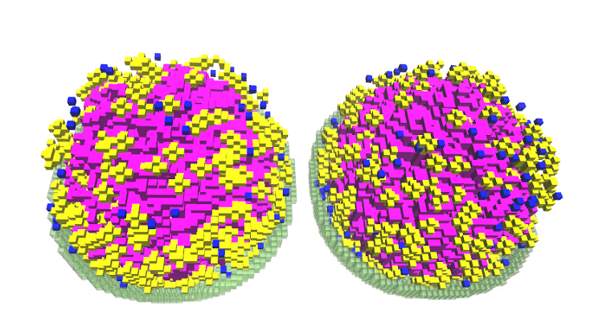

# Visualizing 4DWCM Trajectory

This guide explains how to visualize 4DWCM model trajectories using [VMD 1.9.4a](https://www.ks.uiuc.edu/Development/Download/download.cgi?PackageName=VMD).

VMD and the [VMD plugin](https://github.com/Luthey-Schulten-Lab/LMVMDPlugin) are pre-installed on NCSA Delta HPC.

Since VMD requires a graphical interface, we'll use Open OnDemand's Desktop interactive app to access a Linux GUI for launching VMD and viewing trajectories.

## 1. Initialize the OOD Interactive Session
1. Navigate to the [Open OnDemand dashboard](https://openondemand.delta.ncsa.illinois.edu/pun/sys/dashboard).

2. Log in through CILogon with your NCSA username, password, and Duo MFA.

3. Open the Interactive Apps menu and click Desktop.

4. Configure the job settings and click Launch:
   - Container image: keep default
   - Account: `beyi-delta-gpu`
   - Partition: `GPUA100x4`
   - Duration: `00-01:00:00`
   - Reservation: leave empty if none
   - CPUs: `4`
   - RAM: `32GB`
   - GPUs: `2`

5. Wait for the job status to change from "starting" to "running" in My Interactive Sessions. 

   

   Click "Connect to Desktop" to access the Linux graphical interface.

   

## 2. Load VMD Module
 Open a terminal and run:

```bash
cd /projects/beyi/$USER/SummerSchool_2025/RDME/
bash launch_vmd.sh
```

## 3. 

1. Load the `MinCell_1.lm` trajectory file
```bash
# it should be saved under: 
/projects/beyi/$USER/workshop_2025_RDME/trajectory/MinCell_1.lm
```

2. Load the visualization state `render.vmd`
```bash
/projects/beyi/$USER/workshop_2025_RDME/trajectory/render.vmd
```
Explore the trajectory visualization as needed. 



>[!NOTE]
>We also prepared 3 more trajectories you can explore in the same directory.